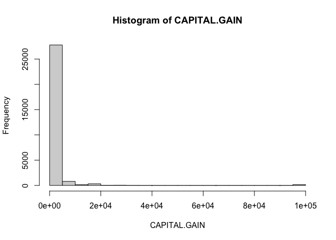
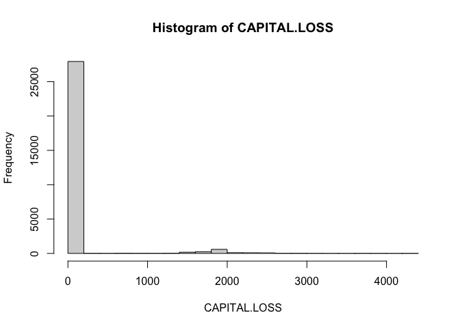
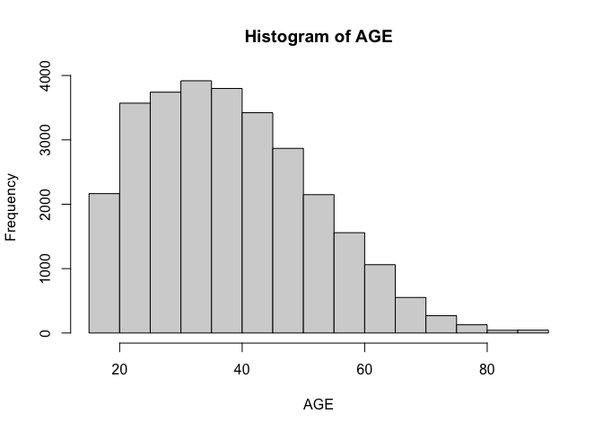
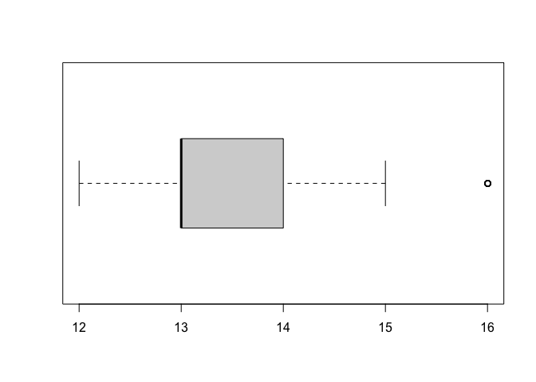
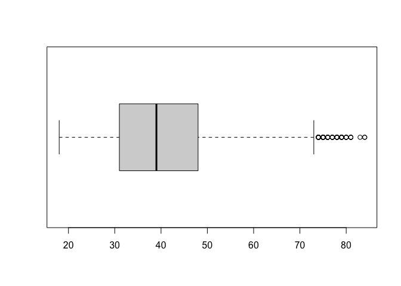
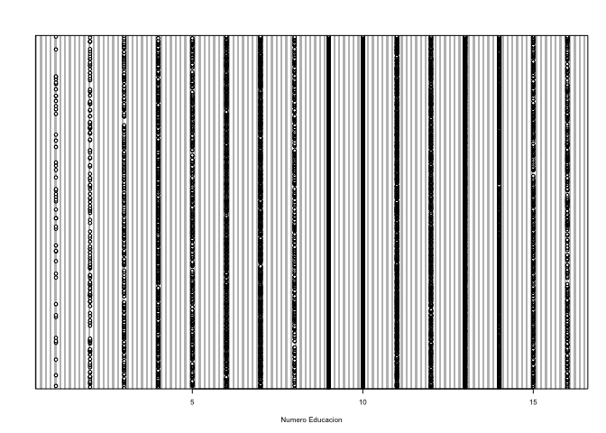

Actividad Ayudantia 2
================

## Análisis Exploratorio de Datos

``` r
library(quanteda)
```

    ## Package version: 2.1.2

    ## Parallel computing: 2 of 4 threads used.

    ## See https://quanteda.io for tutorials and examples.

    ## 
    ## Attaching package: 'quanteda'

    ## The following object is masked from 'package:utils':
    ## 
    ##     View

``` r
library(dplyr)
```

    ## 
    ## Attaching package: 'dplyr'

    ## The following objects are masked from 'package:stats':
    ## 
    ##     filter, lag

    ## The following objects are masked from 'package:base':
    ## 
    ##     intersect, setdiff, setequal, union

``` r
library(tidyverse)
```

    ## ── Attaching packages ─────────────────────────────────────── tidyverse 1.3.0 ──

    ## ✓ ggplot2 3.3.3     ✓ purrr   0.3.4
    ## ✓ tibble  3.1.0     ✓ stringr 1.4.0
    ## ✓ tidyr   1.1.3     ✓ forcats 0.5.1
    ## ✓ readr   1.4.0

    ## ── Conflicts ────────────────────────────────────────── tidyverse_conflicts() ──
    ## x dplyr::filter() masks stats::filter()
    ## x dplyr::lag()    masks stats::lag()

``` r
library(utf8)
library(ggplot2)

setwd('/Users/amara/Documents/GitHub/Actividades-Ayudantias/Ayudantia 2')
Titanic <- read.csv("titanic.csv")
```

``` r
attach(Titanic)
summary(Titanic)
```

    ##       AGE         WORKCLASS             FNLWGT         EDUCATION        
    ##  Min.   :17.00   Length:29286       Min.   :  12285   Length:29286      
    ##  1st Qu.:28.00   Class :character   1st Qu.: 117618   Class :character  
    ##  Median :37.00   Mode  :character   Median : 178127   Mode  :character  
    ##  Mean   :38.59                      Mean   : 189480                     
    ##  3rd Qu.:48.00                      3rd Qu.: 236742                     
    ##  Max.   :90.00                      Max.   :1455435                     
    ##  EDUCATION.NUM   MARITAL.STATUS      OCCUPATION        RELATIONSHIP      
    ##  Min.   : 1.00   Length:29286       Length:29286       Length:29286      
    ##  1st Qu.: 9.00   Class :character   Class :character   Class :character  
    ##  Median :10.00   Mode  :character   Mode  :character   Mode  :character  
    ##  Mean   :10.08                                                           
    ##  3rd Qu.:12.00                                                           
    ##  Max.   :16.00                                                           
    ##      RACE               SEX             CAPITAL.GAIN    CAPITAL.LOSS    
    ##  Length:29286       Length:29286       Min.   :    0   Min.   :   0.00  
    ##  Class :character   Class :character   1st Qu.:    0   1st Qu.:   0.00  
    ##  Mode  :character   Mode  :character   Median :    0   Median :   0.00  
    ##                                        Mean   : 1112   Mean   :  86.05  
    ##                                        3rd Qu.:    0   3rd Qu.:   0.00  
    ##                                        Max.   :99999   Max.   :4356.00  
    ##  HOURS.PER.WEEK  NATIVE.COUNTRY        INCOME         
    ##  Min.   : 1.00   Length:29286       Length:29286      
    ##  1st Qu.:40.00   Class :character   Class :character  
    ##  Median :40.00   Mode  :character   Mode  :character  
    ##  Mean   :40.44                                        
    ##  3rd Qu.:45.00                                        
    ##  Max.   :99.00

``` r
#Borraremos los datos que son tipo char, generando una base de datos de variables numericas.
Titanic <- Titanic[,!(colnames(Titanic) %in% c("WORKCLASS", "EDUCATION", "MARITAL.STATUS", "OCCUPATION", "RELATIONSHIP", "RACE", "SEX", "NATIVE.COUNTRY", "INCOME"))]
```

``` r
#Analisis Descriptivo
Titanic_1 <- Titanic[order(Titanic$AGE, decreasing = TRUE),]
```

``` r
#Filtramos con capital.gain mayor a 0
Titanic_CG <- filter(Titanic_1, CAPITAL.GAIN >0)
summary(Titanic_CG)
```

    ##       AGE            FNLWGT        EDUCATION.NUM    CAPITAL.GAIN  
    ##  Min.   :17.00   Min.   :  19302   Min.   : 1.00   Min.   :  114  
    ##  1st Qu.:35.00   1st Qu.: 117508   1st Qu.: 9.00   1st Qu.: 3411  
    ##  Median :43.00   Median : 175566   Median :11.00   Median : 7298  
    ##  Mean   :43.93   Mean   : 187922   Mean   :11.09   Mean   :13275  
    ##  3rd Qu.:52.00   3rd Qu.: 235816   3rd Qu.:13.00   3rd Qu.:14084  
    ##  Max.   :90.00   Max.   :1033222   Max.   :16.00   Max.   :99999  
    ##   CAPITAL.LOSS HOURS.PER.WEEK 
    ##  Min.   :0     Min.   : 1.00  
    ##  1st Qu.:0     1st Qu.:40.00  
    ##  Median :0     Median :40.00  
    ##  Mean   :0     Mean   :43.48  
    ##  3rd Qu.:0     3rd Qu.:50.00  
    ##  Max.   :0     Max.   :99.00

``` r
#Histogramas de algunas variables
hist(CAPITAL.GAIN)
```

<!-- -->

``` r
hist(CAPITAL.LOSS)
```

<!-- -->

``` r
hist(AGE)
```

<!-- -->

``` r
#Filtramos con edad menor a 85 y numero educacion mayor a 11 que es la media.
Titanic_AGE_EDUC <- filter(Titanic_1, AGE<85, EDUCATION.NUM>11 )
summary(Titanic_AGE_EDUC)
```

    ##       AGE            FNLWGT        EDUCATION.NUM    CAPITAL.GAIN  
    ##  Min.   :18.00   Min.   :  14878   Min.   :12.00   Min.   :    0  
    ##  1st Qu.:31.00   1st Qu.: 116528   1st Qu.:13.00   1st Qu.:    0  
    ##  Median :39.00   Median : 176684   Median :13.00   Median :    0  
    ##  Mean   :40.42   Mean   : 186825   Mean   :13.33   Mean   : 2539  
    ##  3rd Qu.:48.00   3rd Qu.: 230757   3rd Qu.:14.00   3rd Qu.:    0  
    ##  Max.   :84.00   Max.   :1455435   Max.   :16.00   Max.   :99999  
    ##   CAPITAL.LOSS    HOURS.PER.WEEK 
    ##  Min.   :   0.0   Min.   : 1.00  
    ##  1st Qu.:   0.0   1st Qu.:40.00  
    ##  Median :   0.0   Median :40.00  
    ##  Mean   : 137.4   Mean   :43.12  
    ##  3rd Qu.:   0.0   3rd Qu.:50.00  
    ##  Max.   :3683.0   Max.   :99.00

``` r
boxplot(Titanic_AGE_EDUC$EDUCATION.NUM, horizontal = TRUE)
```

<!-- -->

``` r
boxplot(Titanic_AGE_EDUC$AGE, horizontal = TRUE)
```

<!-- -->

``` r
#Maximos y Minimos
max(AGE)
```

    ## [1] 90

``` r
min(EDUCATION.NUM)
```

    ## [1] 1

``` r
dotchart(Titanic$EDUCATION.NUM, labels = utf8_encode(Titanic$WORKCLASS), cex = 0.5, xlab = "Numero Educacion", ylab = "Edad")
```

<!-- -->
