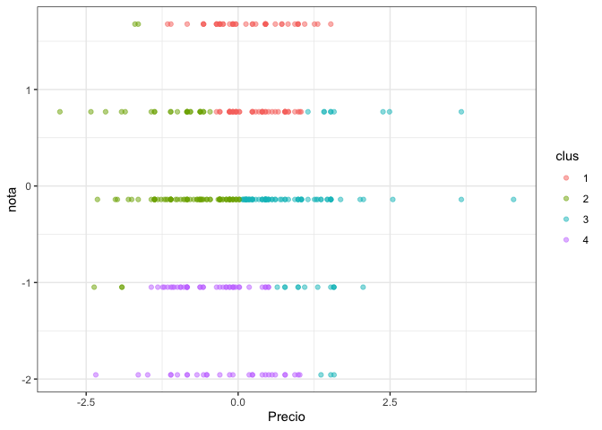
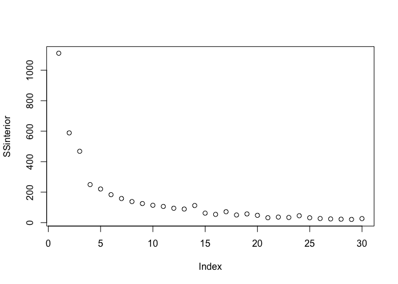
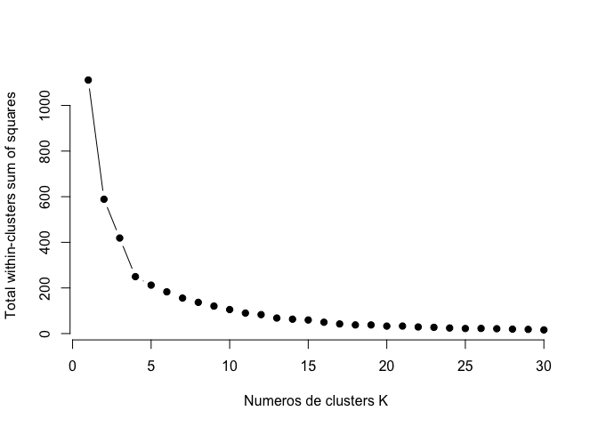
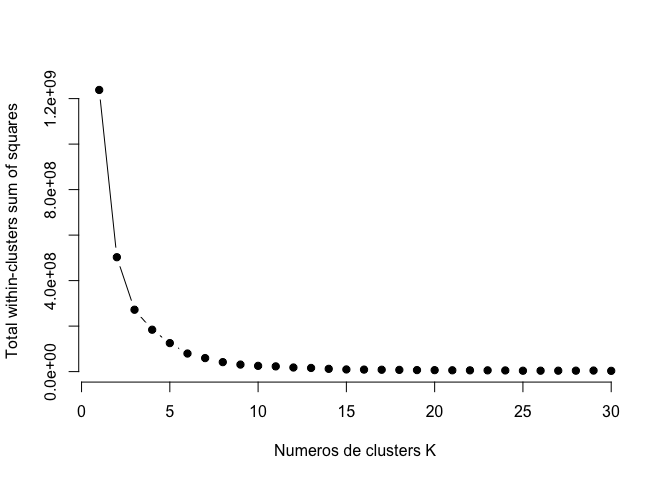
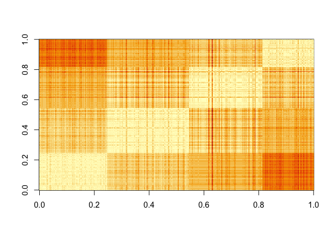

Ayudantia 5
================

``` r
library(tidyverse)
```

    ## ── Attaching packages ─────────────────────────────────────── tidyverse 1.3.0 ──

    ## ✓ ggplot2 3.3.3     ✓ purrr   0.3.4
    ## ✓ tibble  3.1.0     ✓ dplyr   1.0.5
    ## ✓ tidyr   1.1.3     ✓ stringr 1.4.0
    ## ✓ readr   1.4.0     ✓ forcats 0.5.1

    ## ── Conflicts ────────────────────────────────────────── tidyverse_conflicts() ──
    ## x dplyr::filter() masks stats::filter()
    ## x dplyr::lag()    masks stats::lag()

``` r
setwd('/Users/amara/Documents/GitHub/Actividades-Ayudantias/Ayudantia 5')
Sanguchez <- read.csv("sanguchez.csv", sep=';')
```

``` r
head(Sanguchez)
```

    ##                                                               url
    ## 1          https://365sanguchez.com/abocado-cantina-buenos-aires/
    ## 2                   https://365sanguchez.com/alba-hotel-matanzas/
    ## 3   https://365sanguchez.com/albedrio-restaurant-santiago-centro/
    ## 4 https://365sanguchez.com/albedrio-restaurant-santiago-centro-2/
    ## 5              https://365sanguchez.com/aldea-nativa-providencia/
    ## 6            https://365sanguchez.com/aleman-experto-providencia/
    ##                    Local                                             Direccion
    ## 1        Abocado Cantina       C1125AAE, French 2316, C1125AAF CABA, Argentina
    ## 2             Alba Hotel Carlos Iba\xf1ez del Campo s/n \x96 Matanzas, Navidad
    ## 3    Albedrio Restaurant   Hu\xe9rfanos 640, Santiago, Regi\xf3n Metropolitana
    ## 4 Albedr\xedo Restaurant     Pasaje Huerfanos 640 edificio B local 5, Santiago
    ## 5           Aldea Nativa   Tobalaba 1799, Providencia, Regi\xf3n Metropolitana
    ## 6      Alem\xe1n Experto     Av. Pedro de Valdivia 1683, Providencia, Santiago
    ##    Precio
    ## 1 $5.210.
    ## 2  $7.000
    ## 3  $7.290
    ## 4  $8.690
    ## 5  $4.900
    ## 6  $6.500
    ##                                                                                                                           Ingredientes
    ## 1                                                     Suprema de pollo dulce, espinaca, crema \xe1cida, repollo avinagrado y guacamole
    ## 2                        Carne mechada en reducci\xf3n de vino tinto, champi\xf1ones salteados, cebolla caramelizada y queso derretido
    ## 3                             Mayonesa al olivo, champi\xf1ones salteados, jalape\xf1os, queso Mozzarella, papas hilo y cebolla morada
    ## 4                             Queso Mozzarella, R\xfacula, Champi\xf1on portobello relleno de cheddar y luego apanado en panko y frito
    ## 5 Tofu asado no transg\xe9nico, palta, tomate, champi\xf1ones, mix de hojas verdes org\xe1nicas,  mayonesa de zanahoria vegana casera,
    ## 6                                 Hamburguesa, queso Cheddar, cebolla caramelizada, berros, pepinillos y salsa Jack Daniel\x92s Honey.
    ##   nota
    ## 1    3
    ## 2    3
    ## 3    4
    ## 4    4
    ## 5    4
    ## 6    3
    ##                                                                                                                                                                                                                                                                                                                                                                                                                                                                                                                                                                                                                                                                                                                                                                                                                                                                                                                                                                                                                                                                                                                                                                                                                                                                                                                                                                                                                                                                                                                                                                                                                                                                                                                                                                                                                                                                                                                                                                                                                                                                                                                                                                                                                                                                                                                                                                                                                                                                                                                                                                                                                                                                                                                                                                                                                                                                                                                                                                                                                                                                                                                                                                                                                                                                                                                                                                                                                                                                                                                                                                                                                                                                                                                                                                                                                                                                                                                                                                                                                                                                                                                                                                                                          texto
    ## 1                                                                                                                                                                                                                                                                                                                                                                                                                                                                                                                                                                                                                                                                                                                                                                                                                                                                                                                                                                                                                                                                                                                                                                                                                                                                                                                                                                                                                                                                                                                                                                                                                                                                                                                                                                                                                                                                                                                                                                                                                                                                                                                                                                                                                                                                                                                                                                                                                                                                                                                                                                                                                                                                                                                                                                                                                                                                                                                                                                                                                                                                                                                                                                                                                                                                                                                                                                                                                Ojo ac\xe1! En la sangucher\xeda \x93Abocado\x94 (@AbocadoCantina) de Recoleta, m\xe1s que un s\xe1ndwich exquisito (que igual estaba bueno), descubr\xed una maravilla para copiar: ac\xe1 el apanado, el frito del pollo, era dulce. Y bien crocante. Exquisito. Les juro que es el mejor apanado que he probado en mi vida. A esta suprema de pollo dulce, la acompa\xf1aban con espinaca (yo la hubiese puesto a la crema), crema \xe1cida, repollo avinagrado y guacamole. Lamentablemente, la palta ac\xe1 en Argentina no es como la chilena. Es m\xe1s aguachenta. Y el pan, nuevamente sigue la l\xednea que me ha tocado en este pa\xeds, que no logra ser del nivel que tenemos en Chile. Pero insisto: ese batido hay que exportarlo. Estaba exquisito. Y sigo pensando en \xe9l.
    ## 2                                                                                                                                                                                                                                                                                                                                                                                                                                                                                                                                                                                                                                                                                                                                                                                                                                                                                                                                                                                                                                                                                                                                                                                                                                                                                                                                                                                                                                                                                                                                                                                                                                                                                                                                                                                                                                                                                                                                                                                                                                                                                                                                                                                                                                                                                                                                                                                                                                                                                                                                                                                                                                                                                                                                                                                                                                                                                                                                           Aprovechando que me escap\xe9 a Matanzas con\xa0@catabarra_\xa0a canjear mi regalo de cumplea\xf1os (clases de surf), quise probar algunos sanguchitos de la zona. Y como hace un a\xf1o me qued\xe9 a alojar en\xa0@albahotelboutique\xa0y tuve una muy buena experiencia, hoy quise darle una oportunidad a su carta de comida. Y a pesar de que en general nos fue bastante mal (3 de los platos andaban muuuy bajos), mi sanguchito salv\xf3 muy bien. Y es que la mezcla de carne mechada en reducci\xf3n de vino tinto, champi\xf1ones salteados, cebolla caramelizada en marraqueta (y le sum\xe9 queso derretido), es demasiado buena. No falla. As\xed que de 1 a 5, este se lleva 3 narices de chancho. Es decir, es un buen s\xe1ndwich. Vaya a probarlo con confianza. Una marrquetita crujiente y de poca miga, una mechada muy suave y harto queso son sus puntas de lanzas. S\xed, hay cosas por mejorar. Por ejemplo, las \x93mechas\x94 de la carne como que se pegaban unas a otras, entonces a veces de un mordisco te llevabas casi toda la carne. O el caldo lo har\xeda m\xe1s intenso. Porque lo que chorreaba aqu\xed eran los champi\xf1ones m\xe1s que la carne. Pero apa\xf1a harto, adem\xe1s que est\xe1s comiendo EN la playa misma.
    ## 3                                                                                                                                                                                                                                                                                                                                                                                                                                                                                                                                                                                                                                                                                                                                                                                                                                                                                                                                                                                                                                                                                                                                                                                                                                                                                                                                                                                                                                                                                                                                                                                                                                                                                                                                                                                                                                                                                                                                                                                                                                                                                                                                                                                                                                                                                                                                                                                                                                                                                                                                                                                                                                                                                                                                                                                                                                                                                                                                                                                                                                                                                                                                                                                                                                                                                                                                                                                                                                       Sin duda, uno de los lugares que me ENCANTA visitar. Lejos la mejor hamburguesa que tienen es la Portobello (con un champi\xf1\xf3n frito relleno de Cheddar y todo), pero como no estamos en temporada de hongos, no hab\xeda ahora. Esa, sin duda, se lleva cinco narices. Hoy vine a\xa0@RestoAlbedrio\xa0con@MaxKbzon\xa0y nos dimos la torta comiendo. \xc9l fue por un s\xe1ndwich de prieta con manzana verde, papas hilo y mayo de aj\xed verde. Yo, una burger \x93Picante\x94, con mayonesa al olivo, champi\xf1ones salteados, jalape\xf1os, queso Mozzarella, papas hilo y cebolla morada. Solo les adelanto una cosa: tienen una salsa de reducci\xf3n de cerveza con jugo de pi\xf1a y az\xfacar rubia, que debiesen venderla en bidones!! Es EXQUISITA!
    ## 4                                                                                                                                                                                                                                                                                                                                                                                                                                                                                                                                                                                                                                                                                                                                                                                                                                                                                                                                                                                                                                                                                                                                                                                                                                                                                                                                                                                                                                                                                                                                                                                                                                                                                                                                                                                                                                                                                                                                                                                                                                                                                                                                                                                                                                                                                                                                                                                                                                                                                                                                                                                                                                                                                                                  Con\xa0@nitanzorron\xa0fuimos a probar esta maravilla de\xa0@albedrio_resto. Anoten: hamburguesa casera, queso mozzarella, r\xfacula y champi\xf1on portobello relleno de cheddar y luego apanado en panko y frito\xa0. Una maravilla! Es que los champi\xf1ones rellenos ya son at\xf3micos\x85 Pero ahora que vienen fritos, tienes un sabor estratosf\xe9rico. La mejor idea del mundo. Es una verdura muy \x93carnosa\x94 y rica, realzada por el queso y el apanado. El toque amargo de la r\xfacula viene bien, y la hamburguesa en s\xed, creo que es la m\xe1s jugosa que he probado. Me record\xf3 a la de Ciudad Vieja. Anda perfecta. El pan Brioche, bien dulce, y de miga consistente. No tan aireada. Mi \xfanico punto a mejorar es que sent\xed que era muy \x93aguado\x94 (los champi\xf1ones tienen alto porcentaje de agua), por lo que me falt\xf3 malicia. Un picante, o una salsa de ajo\x85 No s\xe9. Algo que te vuele la cabeza. De hecho, Albedr\xedo tiene dos salsas que creo que pondr\xedan a esta hamburguesa en el top chileno: la de la casa, que es una reducci\xf3n de cerveza, pulpa de pi\xf1a y az\xfacar rubia, y una mayonesa con cilantro y ajo que es perfecta. Con\xa0@nitanzorron\xa0conversamos que agregando esa salsa, el sandwich sube de nivel a SS3. Muy buena. Vayan a ver nuestra visita a mi canal de YouTube (link en mi perfil) para todos los detalles y comenten si les tinca porque encuentro que es mega creativa y muuuuy rica.
    ## 5                                                                                                                                                                                                                                                                                                                                                                                                                                                                                                                                                                                                                                                                                                                                                                                                                                                                                                                                                                                                                                                                                                                                                                                                                                                                                                                                                                                                                                                                                                                                                                                                                                                                                                                                                                                                                                                                                                                                                                                                                                                                                                                                                                                                                                                                                                                                                                                                               Ojo los vegetarianos!! Porque gracias a@genoveva_tenaillon\xa0(s\xedganla si quieren ver unas recetas exquisitas pero saludables al mismo tiempo) que me pas\xf3 el dato, encontr\xe9 el templo de los s\xe1ndwiches vegetarianos y jugos naturales wenos wenos wenos. Es Aldea Nativa, en Tobalaba, y a pesar de que es 99% m\xe1s probable que prefiera un s\xe1ndwich carn\xedvoro, creo que los que prob\xe9 ac\xe1 son de los mejorcitos que me han tocado (hasta ahora, en La Tegualda est\xe1n los mejores). El Barros Luco de la Geno estaba bien bueno (con carne de libre pastoreo, sin hormonas ni antibi\xf3ticos\x85 Y no, claramente este no era veggie jaja), pero me gust\xf3 m\xe1s el m\xedo: tofu asado no transg\xe9nico, palta, tomate, champi\xf1ones, mix de hojas verdes org\xe1nicas, y le sum\xe9 una mayonesa de zanahoria vegana casera, que viene con todos los s\xe1ndwiches (\xe9chensela entera). A ver. Era rico, pero la nota se la lleva principalmente porque es el mejor tofu que he probado en Chile. En general lo cocinan muy fome, pero este estaba marinado en soya y asado a la plancha, as\xed que ten\xeda un gustito distinto al t\xedpico \x93quesillo sin sabor\x94 jajaj. Adem\xe1s, ven\xeda como con un cevichito de champi\xf1ones que tambi\xe9n se lo puse adentro\xa0\xa0y agarr\xf3 una jugosidad que el pan agradeci\xf3. Con estos dos ingredientes que le puse, las verduras agarraron un ali\xf1o exquisito. De los vegetarianos que he probado, es de los m\xe1s ricos. Pero si no te gusta el Tofu, tambi\xe9n puedes probar alguna de las hamburguesas vegetarianas que tienen. Me gust\xf3 harto el lugar, adem\xe1s de que tambi\xe9n es un mercado donde venden miles de productos org\xe1nicos, vegetarianos y de esa onda.
    ## 6 Salsa de bourbon: checkAlem\xe1n ExpertoC\xf3mo llegu\xe9 a\xa0Alem\xe1n ExpertoYa hab\xeda venido un par de veces al Alem\xe1n Experto. Tanto al local de Santa Magdalena, como a este de Pedro de Valdivia. En todas las visitas tuve suerte dispar. En algunos me gust\xf3 harto, otras no tanto.La cosa es que hoy tuve que hacer tr\xe1mites cerca, y como ten\xeda poco tiempo para buscar una sangucher\xeda, prefer\xed ir al Alem\xe1n Experto, que a\xfan no lo sumaba a 365 S\xe1nguchez.Fotos tomadas con mi celular Sony Xperia XRestaurante y sangucher\xeda\xa0Alem\xe1n ExpertoAlem\xe1n Experto es una sangucher\xeda que cuenta con dos locales. El primero est\xe1 en Santa Magdalena, y el otro en Pedro de Valdivia, en la esquina con Francisco Bilbao. Ojo, que tambi\xe9n est\xe1n abriendo uno en La Dehesa.Este restaurante es, tal como lo dice su nombre, bien alem\xe1n. Es decir, abundan los s\xe1nguches grandes y la cerveza.Hablando del local de Pedro de Valdivia, siento que hicieron un gran trabajo con su fachada exterior. Si no me creen, miren la foto de m\xe1s arriba. Y es que la terraza que sacaron est\xe1 incre\xedble. Adem\xe1s, por su ubicaci\xf3n, siempre hay gente, por lo que me tinca que se arma buen ambiente para los after office.Les dejo su\xa0pagina web.\xa0Carta de s\xe1ndwiches\xa0Alem\xe1n ExpertoLa carta de s\xe1ndwiches del Alem\xe1n Experto es amplia, tanto en sus bases, como tambi\xe9n en sus combinaciones gourmet y cl\xe1sicas.Por el lado m\xe1s jugado, la sangucher\xeda Alem\xe1n Experto cuenta con hamburguesas y mechadas BBQ. De las primeras, destacan una que tiene camarones y queso azul ($6.400), y la que ped\xed yo. Se llama Jack Daniel\x92s Honey, y tiene una salsa basada en ese licor, adem\xe1s de queso Cheddar, berros, cebolla caramelizada y pepinillos.En las mechadas BBQ, hay dos opciones. una con tocino crispy, y la otra con queso Azul y aros de cebolla.Luego de esta secci\xf3n m\xe1s \x93gourmet\x94, Alem\xe1n Experto tambi\xe9n cuenta con hamburguesas, churrascos, lomitos, aves, salchichas y mechadas para poder armarlas como italianos, lucos y chacareros.Para terminar, hay una secci\xf3n de s\xe1ndwiches vegetarianos. Son hamburguesas de quinoa, y tiene cuatro combinaciones distintas.\xa0Hamburguesa Jack Daniel\x92s Honey en\xa0Alem\xe1n ExpertoA pesar de no ser un fan\xe1tico del bourbon, admito que s\xed me gusta esta variante con toques de miel. Y en una salsa, mejor a\xfan.Tengo que decir que es un s\xe1ndwich correcto. La salsa no se roba el protagonismo, y aporta un toque justo de dulzor y tambi\xe9n de \x93malicia\x94.La cebolla caramelizada estaba suave, y los berros perfectos para contrastar el frescor con lo dulce de la cebolla y la salsa.Lo que no me gust\xf3 tanto, es que la hamburguesa estaba un poco seca. Tuvo suerte, eso s\xed, de que ven\xeda acompa\xf1ada con harta salsa, por lo que lograba pasar piola. Pero si nos quedamos en la carne, le falta.Y el otro punto negativo, y esto ya parece que es una maldici\xf3n que me persigue, fue el queso Cheddar. Primero, porque no estaba derretido. Cueck. Y segundo, porque su sabor era demasiado pl\xe1stico. Les prometo que tengo ganas de hacer una cata de quesos Cheddar, quiz\xe1s con Daniel Greve, para poderles recomendar cu\xe1les son buenos. Pero este, no.Maridaje con Cerveza Austral LagerEn resumen: Alem\xe1n Experto puede ser experto en otras cosas, pero no en hamburguesasReci\xe9n ahora, que estoy escribiendo estas l\xedneas, me doy cuenta que quiz\xe1s hice una movida tonta. Si voy a un lugar que se llama Alem\xe1n Experto, lo normal ser\xeda haber pedido un lomito. Con chucrut, con pepinillos\x85 algo por ah\xed.Se supone que los alemanes tambi\xe9n le pegan a las fricandelas, pero este no fue el caso. De hecho, la carne no era tan especiada como suele serlo en ese pa\xeds. Pero a\xfan as\xed, me tinca que el lomito aqu\xed puede ser un gran acierto.Qued\xe9 con ganas de volver. Volver y probar otra prote\xedna, como el lomito o la mechada. As\xed que nos vemos pronto, Alem\xe1n Experto.

``` r
summary(Sanguchez)
```

    ##      url               Local            Direccion            Precio         
    ##  Length:410         Length:410         Length:410         Length:410        
    ##  Class :character   Class :character   Class :character   Class :character  
    ##  Mode  :character   Mode  :character   Mode  :character   Mode  :character  
    ##                                                                             
    ##                                                                             
    ##                                                                             
    ##                                                                             
    ##  Ingredientes            nota          texto          
    ##  Length:410         Min.   :1.000   Length:410        
    ##  Class :character   1st Qu.:3.000   Class :character  
    ##  Mode  :character   Median :3.000   Mode  :character  
    ##                     Mean   :3.167                     
    ##                     3rd Qu.:4.000                     
    ##                     Max.   :5.000                     
    ##                     NA's   :8

\#Eliminamos datos faltantes y verificamos variables numericas

``` r
Sanguchez = na.omit(Sanguchez)
Sanguchez <- filter(Sanguchez, str_detect(Sanguchez$Precio,"\\$")==T)

Sanguchez$Precio = str_replace_all(Sanguchez$Precio, "^ ", "")
Sanguchez$Precio = str_replace_all(Sanguchez$Precio, " $", "")

attach(Sanguchez)

Sanguchez <- filter(Sanguchez, str_count(Precio, "\\$")==1 &  str_count(Precio," ")==0)

attach(Sanguchez)
```

    ## The following objects are masked from Sanguchez (pos = 3):
    ## 
    ##     Direccion, Ingredientes, Local, nota, Precio, texto, url

``` r
Sanguchez$Precio = str_replace_all(Sanguchez$Precio, "\\$", "")
Sanguchez$Precio = str_replace_all(Sanguchez$Precio, "\\.", "")

Sanguchez$Precio = as.integer(Sanguchez$Precio) 
```

``` r
Sanguchez$nota <-as.numeric(Sanguchez$nota)

datanumerica <- Sanguchez[,colnames(Sanguchez) %in% c("Precio","nota")]

dataescalada = scale(datanumerica) %>% as_tibble()

dataescalada %>% summary()
```

    ##      Precio              nota        
    ##  Min.   :-2.93234   Min.   :-1.9565  
    ##  1st Qu.:-0.62728   1st Qu.:-0.1396  
    ##  Median :-0.03792   Median :-0.1396  
    ##  Mean   : 0.00000   Mean   : 0.0000  
    ##  3rd Qu.: 0.55815   3rd Qu.: 0.7689  
    ##  Max.   : 4.53193   Max.   : 1.6774

\#\#Analisis K-means

``` r
modelokmeans <- kmeans(dataescalada, centers = 4)
modelokmeans2 <- kmeans(datanumerica, centers = 4)

dataescalada$clus <- modelokmeans$cluster %>% as.factor()
datanumerica$clus <- modelokmeans2$cluster %>% as.factor()

ggplot(dataescalada, aes(Precio, nota, color=clus)) +
  geom_point(alpha=0.5, show.legend = T) +
  theme_bw()
```

<!-- -->

``` r
infoclus <- modelokmeans$centers
infoclus2 <- modelokmeans2$centers

infoclus
```

    ##       Precio        nota
    ## 1  0.2338977  1.21804646
    ## 2 -0.8743704  0.08326385
    ## 3  0.9985984 -0.22474118
    ## 4 -0.3581952 -1.42771568

``` r
infoclus2
```

    ##     Precio     nota
    ## 1 9384.211 3.052632
    ## 2 3688.554 2.915663
    ## 3 7180.265 3.221239
    ## 4 5609.516 3.282258

``` r
SSinterior <- numeric(30)

for(k in 1:30){
  modelo <- kmeans(dataescalada, centers = k)
  SSinterior[k] <- modelo$tot.withinss
}

plot(SSinterior)
```

<!-- -->

\#\#Metodo del codo

``` r
k.max <- 30
wss1 <- sapply(1:k.max, 
              function(k){kmeans(dataescalada, k, nstart=50,iter.max = 8)$tot.withinss})
wss2 <- sapply(1:k.max, 
              function(k){kmeans(datanumerica, k, nstart=50,iter.max = 8)$tot.withinss})
```

``` r
#wss1
plot(1:k.max, wss1,
     type="b", pch = 19, frame = FALSE, 
     xlab="Numeros de clusters K",
     ylab="Total within-clusters sum of squares")
```

<!-- -->

``` r
plot(1:k.max, wss2,
     type="b", pch = 19, frame = FALSE, 
     xlab="Numeros de clusters K",
     ylab="Total within-clusters sum of squares")
```

<!-- -->
\#\#Evaluación de Clusteres: Inspección Visual

``` r
dataescalada$clus <- as.numeric(dataescalada$clus)
datanumerica$clus <- as.numeric(datanumerica$clus)

# uso distancia euclidiana
tempDist <- dist(dataescalada) %>% as.matrix()

#reordeno filas y columnas en base al cluster obtenido
index <- sort(modelokmeans$cluster, index.return=TRUE)
tempDist <- tempDist[index$ix,index$ix]
rownames(tempDist) <- c(1:nrow(dataescalada))
colnames(tempDist) <- c(1:nrow(dataescalada))

image(tempDist)
```

<!-- -->
