Ayudantia 8
================

\#Importar Librerías

``` r
library(tidyverse)
```

    ## ── Attaching packages ─────────────────────────────────────── tidyverse 1.3.0 ──

    ## ✓ ggplot2 3.3.3     ✓ purrr   0.3.4
    ## ✓ tibble  3.1.0     ✓ dplyr   1.0.5
    ## ✓ tidyr   1.1.3     ✓ stringr 1.4.0
    ## ✓ readr   1.4.0     ✓ forcats 0.5.1

    ## ── Conflicts ────────────────────────────────────────── tidyverse_conflicts() ──
    ## x dplyr::filter() masks stats::filter()
    ## x dplyr::lag()    masks stats::lag()

``` r
library(cluster)
library(factoextra)
```

    ## Welcome! Want to learn more? See two factoextra-related books at https://goo.gl/ve3WBa

``` r
library(mclust)
```

    ## Package 'mclust' version 5.4.7
    ## Type 'citation("mclust")' for citing this R package in publications.

    ## 
    ## Attaching package: 'mclust'

    ## The following object is masked from 'package:purrr':
    ## 
    ##     map

\#Cargar Datos

``` r
setwd('/Users/amara/Documents/GitHub/Actividades-Ayudantias/Ayudantia 8')
spotify <- read.csv("Spotify.csv")
```

PRIMER ANALISIS

\#Datos NA

``` r
spotify %>% 
  summarise_all(funs(sum(is.na(.))))
```

    ## Warning: `funs()` was deprecated in dplyr 0.8.0.
    ## Please use a list of either functions or lambdas: 
    ## 
    ##   # Simple named list: 
    ##   list(mean = mean, median = median)
    ## 
    ##   # Auto named with `tibble::lst()`: 
    ##   tibble::lst(mean, median)
    ## 
    ##   # Using lambdas
    ##   list(~ mean(., trim = .2), ~ median(., na.rm = TRUE))

    ##   artist_name track_name album_name danceability energy key loudness mode
    ## 1           0          0          0            0      0   0        0    0
    ##   speechiness acousticness instrumentalness liveness valence tempo duration_ms
    ## 1           0            0                0        0       0     0           0

``` r
#Eliminamos 3 variables categoricas que parecen ser irrelevantes para nuestro analisis
spotify$artist_name <- NULL
spotify$album_name <- NULL
spotify$track_name <- NULL
str(spotify)
```

    ## 'data.frame':    13000 obs. of  12 variables:
    ##  $ danceability    : num  0.222 0.287 0.235 0.322 0.447 0.117 0.596 0.445 0.363 0.159 ...
    ##  $ energy          : num  0.78 0.545 1 0.105 0.054 0.411 0.049 0.785 0.112 0.24 ...
    ##  $ key             : int  0 11 0 1 2 10 10 0 6 0 ...
    ##  $ loudness        : num  -29.7 -16.2 -15.4 -25.7 -31.1 ...
    ##  $ mode            : int  1 0 0 1 1 0 1 1 1 0 ...
    ##  $ speechiness     : num  0.1 0.0309 0.0977 0.0401 0.0382 0.0654 0.0438 0.0353 0.0407 0.037 ...
    ##  $ acousticness    : num  0.67 0.706 0.79 0.99 0.974 0.000738 0.973 0.172 0.989 0.979 ...
    ##  $ instrumentalness: num  0.897 0.909 0.862 0.876 0.899 0.938 0.634 0 0.882 0.533 ...
    ##  $ liveness        : num  0.662 0.0482 0.96 0.142 0.137 0.886 0.074 0.372 0.102 0.501 ...
    ##  $ valence         : num  0.0127 0.84 0.00001 0.246 0.281 0.0463 0.343 0.554 0.0859 0.148 ...
    ##  $ tempo           : num  86.2 137 83.5 65.1 127.4 ...
    ##  $ duration_ms     : int  153469 362653 197488 118315 154706 82207 240010 226520 148973 501306 ...

``` r
set.seed(500)

spotify_muestra <- spotify[sample(nrow(spotify), 7000),]
class <- spotify_muestra$duration_ms
muestra <- spotify_muestra[,1:10]
```

\#Escalar datos

``` r
set.seed(500)
muestra_sca <- sapply(muestra, scale) %>% as_tibble()

clPairs(muestra_sca, class)
```

    ## Warning in clPairs(muestra_sca, class): more colors needed

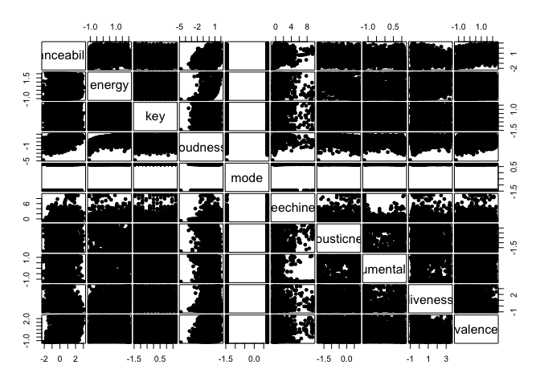<!-- -->

\#\#\#DBSCAN Podemos ver que tenemos 3 clusters generados por dbscan.

``` r
library(dbscan)

set.seed(500)

model = dbscan(muestra_sca, eps = 2, minPts = 7)

model
```

    ## DBSCAN clustering for 7000 objects.
    ## Parameters: eps = 2, minPts = 7
    ## The clustering contains 8 cluster(s) and 109 noise points.
    ## 
    ##    0    1    2    3    4    5    6    7    8 
    ##  109 4652 2175    7   20   15    7    8    7 
    ## 
    ## Available fields: cluster, eps, minPts

\#\#Plot

``` r
ggplot(muestra_sca, aes(energy, liveness, color = factor(model$cluster), size = energy)) + 
  geom_point(alpha = 0.3) 
```

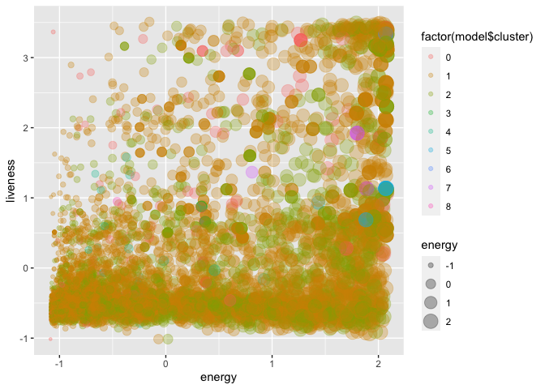<!-- -->

\#\#\#FUZZY C-MEANS

``` r
library(e1071)

set.seed(500)

modelo_cmeans <- cmeans(muestra_sca,  7, m=2) 

modelo_cmeans$membership %>% head()
```

    ##              1         2         3          4          5         6         7
    ## [1,] 0.1493106 0.1867996 0.1503574 0.10767420 0.10767339 0.1499498 0.1482351
    ## [2,] 0.1681199 0.1830499 0.1689972 0.07198772 0.07198677 0.1686576 0.1672010
    ## [3,] 0.1426743 0.1574432 0.1428943 0.13586482 0.13586351 0.1428083 0.1424516
    ## [4,] 0.1704246 0.1629337 0.1709146 0.07755493 0.07755416 0.1707274 0.1698906
    ## [5,] 0.1923530 0.1256449 0.1908740 0.05290381 0.05290341 0.1914501 0.1938707
    ## [6,] 0.1701839 0.1808641 0.1711097 0.06893697 0.06893632 0.1707509 0.1692180

\#\#Plot

``` r
ggplot(muestra_sca, aes(energy, liveness, color = factor(modelo_cmeans$cluster), size = energy)) + 
  geom_point(alpha = 0.3) 
```

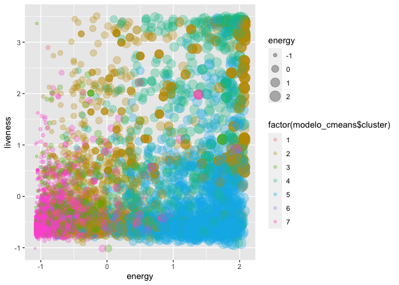<!-- -->

\#\#FCP

``` r
matriz <- modelo_cmeans$membership%*%t(modelo_cmeans$membership)

(FPC <- sum(matriz*diag(nrow(matriz)))/nrow(matriz))
```

    ## [1] 0.1676891

\#\#\#GMM

``` r
set.seed(500)

model_gmm = Mclust(muestra_sca)

model_gmm 
```

    ## 'Mclust' model object: (VEV,8) 
    ## 
    ## Available components: 
    ##  [1] "call"           "data"           "modelName"      "n"             
    ##  [5] "d"              "G"              "BIC"            "loglik"        
    ##  [9] "df"             "bic"            "icl"            "hypvol"        
    ## [13] "parameters"     "z"              "classification" "uncertainty"

``` r
summary(model_gmm, parameters = TRUE)
```

    ## ---------------------------------------------------- 
    ## Gaussian finite mixture model fitted by EM algorithm 
    ## ---------------------------------------------------- 
    ## 
    ## Mclust VEV (ellipsoidal, equal shape) model with 8 components: 
    ## 
    ##  log-likelihood    n  df       BIC       ICL
    ##       -44128.46 7000 464 -92365.02 -92917.23
    ## 
    ## Clustering table:
    ##    1    2    3    4    5    6    7    8 
    ## 1299  480  829 1247  625 1070  906  544 
    ## 
    ## Mixing probabilities:
    ##          1          2          3          4          5          6          7 
    ## 0.18527107 0.06854575 0.11837667 0.17928402 0.08941975 0.15548644 0.12545270 
    ##          8 
    ## 0.07816359 
    ## 
    ## Means:
    ##                         [,1]        [,2]        [,3]        [,4]       [,5]
    ## danceability     -0.20444790 -0.91141167 -0.19689557  0.59538316  0.5607128
    ## energy           -0.59559833  1.44503607 -0.57907315  0.77909795  0.8513072
    ## key               0.05139642 -0.03182033 -0.01493915 -0.03445445  0.1042362
    ## loudness         -0.39115535 -0.47640804 -0.13921397  0.93118432  0.9400737
    ## mode             -1.44622749 -0.16576447  0.69135537  0.69135537 -0.7344953
    ## speechiness      -0.25888441  0.30137038 -0.27228445 -0.05750900 -0.3070078
    ## acousticness      0.63992297 -0.75308234  0.57117762 -0.94214765 -1.2094080
    ## instrumentalness  0.34526705  0.39329125 -0.56759889 -1.18773684 -0.2225423
    ## liveness         -0.42277252  1.52142327 -0.41155372  0.41663564  0.3359361
    ## valence          -0.14552334 -1.12069363 -0.09365828  0.53198987  0.3394968
    ##                         [,6]        [,7]       [,8]
    ## danceability      0.08981013 -0.84672692  0.7553127
    ## energy           -0.57714217 -0.89971592  0.8527102
    ## key              -0.13463192 -0.05608254  0.2463144
    ## loudness         -0.38145624 -0.99441444  0.6993131
    ## mode              0.69135537  0.69135537 -0.7040764
    ## speechiness      -0.24346764 -0.29880937  2.2087474
    ## acousticness      0.76243435  0.73215224 -0.8686195
    ## instrumentalness  0.91542856  0.90278372 -0.5947454
    ## liveness         -0.36555096 -0.51320415  0.5020804
    ## valence           0.44004889 -0.80780957  0.2821295
    ## 
    ## Variances:
    ## [,,1]
    ##                   danceability        energy           key      loudness
    ## danceability      6.759133e-01  1.664006e-01  2.673759e-02  3.078436e-01
    ## energy            1.664006e-01  1.803606e-01  6.869587e-03  2.397091e-01
    ## key               2.673759e-02  6.869587e-03  1.074269e+00 -5.659756e-03
    ## loudness          3.078436e-01  2.397091e-01 -5.659756e-03  5.814319e-01
    ## mode             -1.215134e-18 -3.825412e-17 -3.787301e-17 -1.834284e-17
    ## speechiness       2.587688e-02 -1.095920e-03  7.606337e-03 -5.441804e-03
    ## acousticness     -4.613399e-02 -5.909879e-02 -9.173877e-03 -8.355471e-02
    ## instrumentalness -1.459803e-01 -8.926704e-02 -5.078259e-02 -2.148773e-01
    ## liveness          1.296368e-02  2.381402e-02  1.126215e-02  2.914249e-02
    ## valence           4.876522e-01  1.787830e-01  1.797425e-02  2.150836e-01
    ##                           mode   speechiness  acousticness instrumentalness
    ## danceability     -1.215134e-18  2.587688e-02 -4.613399e-02    -1.459803e-01
    ## energy           -3.825412e-17 -1.095920e-03 -5.909879e-02    -8.926704e-02
    ## key              -3.787301e-17  7.606337e-03 -9.173877e-03    -5.078259e-02
    ## loudness         -1.834284e-17 -5.441804e-03 -8.355471e-02    -2.148773e-01
    ## mode              5.284052e-04 -1.153970e-17 -1.229462e-16    -6.715610e-18
    ## speechiness      -1.153970e-17  1.354292e-02  9.726414e-04    -7.998028e-03
    ## acousticness     -1.229462e-16  9.726414e-04  7.345300e-02     8.400415e-02
    ## instrumentalness -6.715610e-18 -7.998028e-03  8.400415e-02     6.837749e-01
    ## liveness         -3.839603e-17  6.319140e-05 -1.034169e-02    -4.172738e-02
    ## valence           1.679066e-17  1.115496e-02 -3.387026e-02    -1.439518e-01
    ##                       liveness       valence
    ## danceability      1.296368e-02  4.876522e-01
    ## energy            2.381402e-02  1.787830e-01
    ## key               1.126215e-02  1.797425e-02
    ## loudness          2.914249e-02  2.150836e-01
    ## mode             -3.839603e-17  1.679066e-17
    ## speechiness       6.319140e-05  1.115496e-02
    ## acousticness     -1.034169e-02 -3.387026e-02
    ## instrumentalness -4.172738e-02 -1.439518e-01
    ## liveness          1.117241e-01  2.857873e-02
    ## valence           2.857873e-02  8.127474e-01
    ## [,,2]
    ##                  danceability      energy         key    loudness         mode
    ## danceability       0.29150410  0.16991831  0.11212395  0.21049747  0.226459719
    ## energy             0.16991831  1.47369298  0.01053443  0.76884317  0.213652123
    ## key                0.11212395  0.01053443  3.06101778 -0.01324638 -1.510551291
    ## loudness           0.21049747  0.76884317 -0.01324638  1.03142764  0.212646113
    ## mode               0.22645972  0.21365212 -1.51055129  0.21264611  2.836551335
    ## speechiness        0.20012228 -0.04021732  0.10253004  0.58614810  0.017108904
    ## acousticness       0.23619931  1.20773838  0.32610525  0.58696276 -0.091913201
    ## instrumentalness  -0.12705707  0.05422657 -0.32354714 -0.47575637  0.166658860
    ## liveness          -0.09111156  1.85166596 -0.22082189  0.88940016 -0.277160012
    ## valence            0.01368340 -0.14005848  0.03188828 -0.01279122 -0.004684799
    ##                  speechiness acousticness instrumentalness    liveness
    ## danceability      0.20012228   0.23619931      -0.12705707 -0.09111156
    ## energy           -0.04021732   1.20773838       0.05422657  1.85166596
    ## key               0.10253004   0.32610525      -0.32354714 -0.22082189
    ## loudness          0.58614810   0.58696276      -0.47575637  0.88940016
    ## mode              0.01710890  -0.09191320       0.16665886 -0.27716001
    ## speechiness       1.05182472   0.02892751      -1.08024265  0.07273580
    ## acousticness      0.02892751   1.59256705       0.05875928  1.54174328
    ## instrumentalness -1.08024265   0.05875928       1.57567660  0.12460869
    ## liveness          0.07273580   1.54174328       0.12460869  4.85230700
    ## valence           0.09208181  -0.10878810      -0.09745280 -0.23408056
    ##                       valence
    ## danceability      0.013683396
    ## energy           -0.140058476
    ## key               0.031888280
    ## loudness         -0.012791225
    ## mode             -0.004684799
    ## speechiness       0.092081810
    ## acousticness     -0.108788102
    ## instrumentalness -0.097452798
    ## liveness         -0.234080562
    ## valence           0.025162990
    ## [,,3]
    ##                   danceability        energy           key      loudness
    ## danceability      5.690358e-01  9.707606e-02  4.065092e-02  2.063799e-01
    ## energy            9.707606e-02  1.299659e-01  4.430393e-03  1.557049e-01
    ## key               4.065092e-02  4.430393e-03  8.357686e-01  1.400083e-02
    ## loudness          2.063799e-01  1.557049e-01  1.400083e-02  3.845230e-01
    ## mode             -1.163015e-18  6.670252e-18 -3.621785e-17  2.382228e-17
    ## speechiness       2.965976e-03 -6.332471e-03 -1.911412e-03 -1.384483e-02
    ## acousticness     -2.002073e-02 -4.036893e-02 -2.847246e-03 -3.391414e-02
    ## instrumentalness  1.672449e-04  4.950499e-02  2.218351e-02  5.510078e-03
    ## liveness         -4.167923e-03 -2.693025e-03  1.178572e-02  1.453935e-03
    ## valence           4.476519e-01  1.298988e-01  4.242976e-02  1.873852e-01
    ##                           mode   speechiness  acousticness instrumentalness
    ## danceability     -1.163015e-18  2.965976e-03 -2.002073e-02     1.672449e-04
    ## energy            6.670252e-18 -6.332471e-03 -4.036893e-02     4.950499e-02
    ## key              -3.621785e-17 -1.911412e-03 -2.847246e-03     2.218351e-02
    ## loudness          2.382228e-17 -1.384483e-02 -3.391414e-02     5.510078e-03
    ## mode              4.071188e-04 -2.650776e-17 -5.928574e-17     3.810192e-17
    ## speechiness      -2.650776e-17  9.745564e-03  3.076176e-03    -5.584992e-03
    ## acousticness     -5.928574e-17  3.076176e-03  5.800948e-02    -7.705856e-02
    ## instrumentalness  3.810192e-17 -5.584992e-03 -7.705856e-02     4.854938e-01
    ## liveness         -8.733794e-17 -1.098082e-03  3.700148e-03    -1.888724e-05
    ## valence          -1.107164e-17 -2.144044e-03 -1.657658e-02     1.248112e-02
    ##                       liveness       valence
    ## danceability     -4.167923e-03  4.476519e-01
    ## energy           -2.693025e-03  1.298988e-01
    ## key               1.178572e-02  4.242976e-02
    ## loudness          1.453935e-03  1.873852e-01
    ## mode             -8.733794e-17 -1.107164e-17
    ## speechiness      -1.098082e-03 -2.144044e-03
    ## acousticness      3.700148e-03 -1.657658e-02
    ## instrumentalness -1.888724e-05  1.248112e-02
    ## liveness          8.233072e-02  4.403473e-03
    ## valence           4.403473e-03  6.866496e-01
    ## [,,4]
    ##                   danceability        energy           key      loudness
    ## danceability      9.911892e-01  1.771038e-01  9.271685e-02  3.449079e-01
    ## energy            1.771038e-01  7.061953e-01 -1.829533e-02  4.957160e-01
    ## key               9.271685e-02 -1.829533e-02  1.010300e+00  9.223171e-03
    ## loudness          3.449079e-01  4.957160e-01  9.223171e-03  5.264391e-01
    ## mode              1.061992e-18 -4.361299e-17 -3.935910e-17 -8.770599e-18
    ## speechiness      -5.531120e-02  2.363083e-02 -1.594546e-02 -3.045531e-02
    ## acousticness     -1.370662e-01 -5.731240e-01  3.949713e-02 -4.026749e-01
    ## instrumentalness -1.464171e-02  8.603039e-04 -1.648515e-03 -6.272541e-03
    ## liveness         -5.878241e-01  1.184008e-01 -2.932074e-02 -1.026543e-01
    ## valence           5.812650e-01  3.059430e-01  1.143990e-01  3.111899e-01
    ##                           mode   speechiness  acousticness instrumentalness
    ## danceability      1.061992e-18 -5.531120e-02 -1.370662e-01    -1.464171e-02
    ## energy           -4.361299e-17  2.363083e-02 -5.731240e-01     8.603039e-04
    ## key              -3.935910e-17 -1.594546e-02  3.949713e-02    -1.648515e-03
    ## loudness         -8.770599e-18 -3.045531e-02 -4.026749e-01    -6.272541e-03
    ## mode              8.349764e-04 -1.343326e-17  3.235718e-17    -1.000972e-17
    ## speechiness      -1.343326e-17  1.378138e-01 -1.082416e-02    -3.088435e-05
    ## acousticness      3.235718e-17 -1.082416e-02  7.037734e-01    -5.088677e-04
    ## instrumentalness -1.000972e-17 -3.088435e-05 -5.088677e-04     1.854042e-02
    ## liveness         -5.847532e-17  1.687612e-01 -2.259407e-03     1.094649e-02
    ## valence          -2.852612e-17 -5.154491e-02 -1.767851e-01    -8.658238e-03
    ##                       liveness       valence
    ## danceability     -5.878241e-01  5.812650e-01
    ## energy            1.184008e-01  3.059430e-01
    ## key              -2.932074e-02  1.143990e-01
    ## loudness         -1.026543e-01  3.111899e-01
    ## mode             -5.847532e-17 -2.852612e-17
    ## speechiness       1.687612e-01 -5.154491e-02
    ## acousticness     -2.259407e-03 -1.767851e-01
    ## instrumentalness  1.094649e-02 -8.658238e-03
    ## liveness          1.644413e+00 -3.865590e-01
    ## valence          -3.865590e-01  9.095045e-01
    ## [,,5]
    ##                  danceability      energy          key     loudness        mode
    ## danceability       2.48339061  1.16857945  0.146493286  0.930839918 -0.28297611
    ## energy             1.16857945  1.36389610  0.085675777  1.057084836 -0.53704605
    ## key                0.14649329  0.08567578  2.768351255  0.119627095 -1.35045827
    ## loudness           0.93083992  1.05708484  0.119627095  0.974249940 -0.72489788
    ## mode              -0.28297611 -0.53704605 -1.350458269 -0.724897877  2.82774923
    ## speechiness       -0.02109029  0.01002337  0.001554763 -0.006711663  0.01767141
    ## acousticness      -0.76003280 -1.07375029  0.045636807 -0.909649221  0.43921328
    ## instrumentalness  -0.61267255 -0.65908946 -0.792444942 -0.775103611  1.98669612
    ## liveness          -1.22286177 -0.78145414  0.216430586 -0.765607223  0.01800330
    ## valence            1.79472912  0.91725344  0.147167714  0.597616898 -0.12829120
    ##                   speechiness acousticness instrumentalness    liveness
    ## danceability     -0.021090291 -0.760032799      -0.61267255 -1.22286177
    ## energy            0.010023372 -1.073750293      -0.65908946 -0.78145414
    ## key               0.001554763  0.045636807      -0.79244494  0.21643059
    ## loudness         -0.006711663 -0.909649221      -0.77510361 -0.76560722
    ## mode              0.017671412  0.439213281       1.98669612  0.01800330
    ## speechiness       0.005287687 -0.001236384       0.01610197  0.05153566
    ## acousticness     -0.001236384  1.416283160       0.39928319  1.42636110
    ## instrumentalness  0.016101970  0.399283193       2.16697635 -0.17491132
    ## liveness          0.051535664  1.426361104      -0.17491132  3.77495146
    ## valence          -0.015100951 -0.259258090      -0.61151966 -0.28522427
    ##                      valence
    ## danceability      1.79472912
    ## energy            0.91725344
    ## key               0.14716771
    ## loudness          0.59761690
    ## mode             -0.12829120
    ## speechiness      -0.01510095
    ## acousticness     -0.25925809
    ## instrumentalness -0.61151966
    ## liveness         -0.28522427
    ## valence           2.47388955
    ## [,,6]
    ##                   danceability        energy           key      loudness
    ## danceability      3.069746e-01 -3.728138e-02  5.184380e-02 -3.789270e-02
    ## energy           -3.728138e-02  1.057262e-01 -1.112621e-02  9.700026e-02
    ## key               5.184380e-02 -1.112621e-02  6.076978e-01 -3.288387e-02
    ## loudness         -3.789270e-02  9.700026e-02 -3.288387e-02  2.612521e-01
    ## mode              4.747461e-18 -1.831269e-17  1.647650e-17 -4.967130e-17
    ## speechiness       3.022154e-02 -9.396219e-03  3.637791e-03 -1.777114e-02
    ## acousticness      4.980467e-03 -6.245569e-03  3.494252e-03 -1.123113e-02
    ## instrumentalness -2.180409e-03 -7.864873e-04 -5.029403e-03 -8.448580e-03
    ## liveness         -2.628380e-02  1.089934e-02  4.313359e-03  2.513309e-02
    ## valence           1.824193e-01  2.304534e-02  1.004955e-01 -1.922976e-02
    ##                           mode   speechiness  acousticness instrumentalness
    ## danceability      4.747461e-18  3.022154e-02  4.980467e-03    -2.180409e-03
    ## energy           -1.831269e-17 -9.396219e-03 -6.245569e-03    -7.864873e-04
    ## key               1.647650e-17  3.637791e-03  3.494252e-03    -5.029403e-03
    ## loudness         -4.967130e-17 -1.777114e-02 -1.123113e-02    -8.448580e-03
    ## mode              2.673087e-04  6.726377e-18  3.507963e-17    -2.949335e-17
    ## speechiness       6.726377e-18  2.482426e-02  5.360783e-04    -5.655067e-03
    ## acousticness      3.507963e-17  5.360783e-04  6.608501e-03     1.447130e-03
    ## instrumentalness -2.949335e-17 -5.655067e-03  1.447130e-03     3.628094e-02
    ## liveness          1.371711e-17 -6.428125e-03 -5.424142e-03    -3.940092e-03
    ## valence          -1.049365e-17  5.557686e-03  5.229968e-03    -4.577561e-03
    ##                       liveness       valence
    ## danceability     -2.628380e-02  1.824193e-01
    ## energy            1.089934e-02  2.304534e-02
    ## key               4.313359e-03  1.004955e-01
    ## loudness          2.513309e-02 -1.922976e-02
    ## mode              1.371711e-17 -1.049365e-17
    ## speechiness      -6.428125e-03  5.557686e-03
    ## acousticness     -5.424142e-03  5.229968e-03
    ## instrumentalness -3.940092e-03 -4.577561e-03
    ## liveness          1.222715e-01 -1.087756e-02
    ## valence          -1.087756e-02  6.567040e-01
    ## [,,7]
    ##                   danceability        energy           key      loudness
    ## danceability      1.850105e-01  9.157223e-04  1.761125e-02  3.194629e-02
    ## energy            9.157223e-04  2.758334e-02  1.158819e-03  4.453417e-02
    ## key               1.761125e-02  1.158819e-03  4.435493e-01  3.012467e-02
    ## loudness          3.194629e-02  4.453417e-02  3.012467e-02  2.967917e-01
    ## mode              1.841289e-20 -3.574358e-18  9.881448e-20  6.059393e-19
    ## speechiness      -2.494740e-03 -1.056130e-03 -1.578539e-03 -7.663811e-03
    ## acousticness      1.353512e-02 -3.830404e-03  2.930708e-03  4.986235e-04
    ## instrumentalness  2.197165e-03 -1.288663e-03 -2.849172e-03 -1.678090e-02
    ## liveness         -8.074107e-03  2.671930e-04 -4.968040e-03  4.774783e-03
    ## valence           2.228166e-02  7.822429e-03  6.014190e-03  1.442351e-03
    ##                           mode   speechiness  acousticness instrumentalness
    ## danceability      1.841289e-20 -2.494740e-03  1.353512e-02     2.197165e-03
    ## energy           -3.574358e-18 -1.056130e-03 -3.830404e-03    -1.288663e-03
    ## key               9.881448e-20 -1.578539e-03  2.930708e-03    -2.849172e-03
    ## loudness          6.059393e-19 -7.663811e-03  4.986235e-04    -1.678090e-02
    ## mode              1.501080e-04  2.206064e-17  1.818495e-18    -4.001558e-18
    ## speechiness       2.206064e-17  3.631698e-03 -9.693506e-04    -1.587586e-04
    ## acousticness      1.818495e-18 -9.693506e-04  1.512506e-02     2.833817e-03
    ## instrumentalness -4.001558e-18 -1.587586e-04  2.833817e-03     3.542796e-02
    ## liveness          5.945303e-18  5.064754e-04 -1.058212e-02    -1.098371e-02
    ## valence           2.301916e-18 -3.811857e-03  4.944273e-03     2.471063e-03
    ##                       liveness       valence
    ## danceability     -8.074107e-03  2.228166e-02
    ## energy            2.671930e-04  7.822429e-03
    ## key              -4.968040e-03  6.014190e-03
    ## loudness          4.774783e-03  1.442351e-03
    ## mode              5.945303e-18  2.301916e-18
    ## speechiness       5.064754e-04 -3.811857e-03
    ## acousticness     -1.058212e-02  4.944273e-03
    ## instrumentalness -1.098371e-02  2.471063e-03
    ## liveness          6.097132e-02  4.536042e-03
    ## valence           4.536042e-03  1.270846e-01
    ## [,,8]
    ##                  danceability      energy         key   loudness       mode
    ## danceability      10.08222520 -1.61895964 -0.09849167  3.4608704  0.5648593
    ## energy            -1.61895964  5.73971286  0.74816503  4.0961983 -0.8486690
    ## key               -0.09849167  0.74816503  7.55467798 -0.1308111 -3.3498470
    ## loudness           3.46087036  4.09619834 -0.13081113  5.8658441 -0.6087327
    ## mode               0.56485928 -0.84866902 -3.34984697 -0.6087327  5.9172823
    ## speechiness        1.10490213 -2.99223778  0.72841388 -4.6328190  4.5489787
    ## acousticness      -0.47849345 -4.65865254 -0.55722773 -4.5236593  0.4167651
    ## instrumentalness  -1.89950624 -1.24898494 -0.30392667 -2.8619158  1.1653027
    ## liveness          -7.95518376  2.76602515  0.11148241 -1.3910280 -1.0262221
    ## valence            6.69520694 -0.09840173 -0.64211771  3.8808799  0.4843561
    ##                  speechiness acousticness instrumentalness   liveness
    ## danceability       1.1049021   -0.4784935       -1.8995062 -7.9551838
    ## energy            -2.9922378   -4.6586525       -1.2489849  2.7660251
    ## key                0.7284139   -0.5572277       -0.3039267  0.1114824
    ## loudness          -4.6328190   -4.5236593       -2.8619158 -1.3910280
    ## mode               4.5489787    0.4167651        1.1653027 -1.0262221
    ## speechiness       33.9090327    4.2487290       -2.0531397  1.1235828
    ## acousticness       4.2487290    5.3423791        2.0388524 -0.1161366
    ## instrumentalness  -2.0531397    2.0388524        4.4358718 -0.3768827
    ## liveness           1.1235828   -0.1161366       -0.3768827 12.0249799
    ## valence            0.6687742   -1.1910386       -3.1534348 -4.4255789
    ##                      valence
    ## danceability      6.69520694
    ## energy           -0.09840173
    ## key              -0.64211771
    ## loudness          3.88087993
    ## mode              0.48435609
    ## speechiness       0.66877422
    ## acousticness     -1.19103857
    ## instrumentalness -3.15343478
    ## liveness         -4.42557891
    ## valence           6.57397139

\#\#Plot

``` r
ggplot(muestra_sca) + 
  aes(x=energy, y=liveness, color=factor(model_gmm$classification)) + 
  geom_point(alpha=1)
```

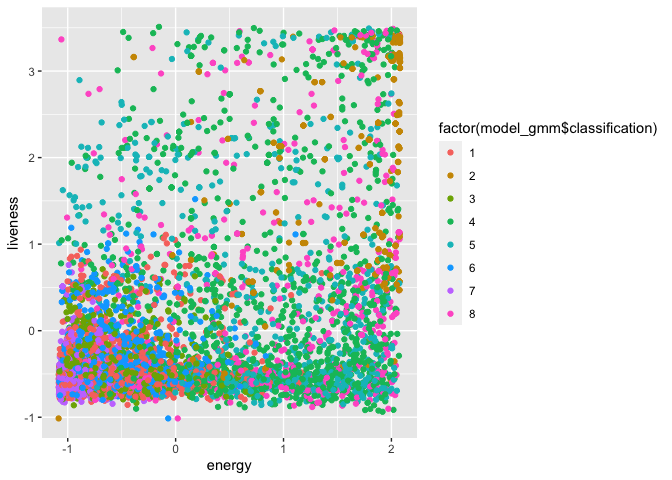<!-- -->

``` r
fviz_cluster(model_gmm, muestra_sca, stand = FALSE, frame = FALSE,geom = "point")
```

    ## Warning: argument frame is deprecated; please use ellipse instead.

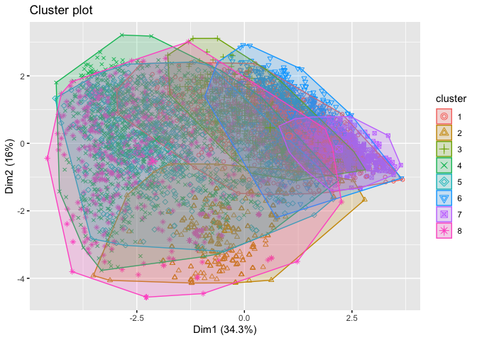<!-- -->

\#\#BIC

``` r
plot(model_gmm, what = "BIC")
```

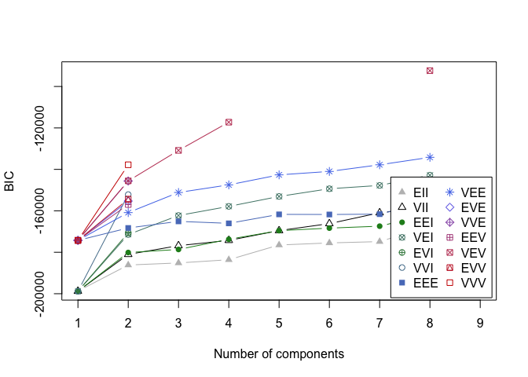<!-- -->

SEGUNDO ANÁLISIS

Realizamos un segundo analisis eliminando las variables que podrian
estar correlacionada y que seria rebundante tener ambas.

``` r
spotify_muestra1 <- spotify_muestra[colnames(spotify_muestra) %in% c("energy", "key", "loudness","speechness", "acousticness")]

class1 <- spotify_muestra1$energy

muestra1_sca <- sapply(spotify_muestra1, scale) %>% as_tibble()

clPairs(muestra1_sca,class1)
```

    ## Warning in clPairs(muestra1_sca, class1): more colors needed

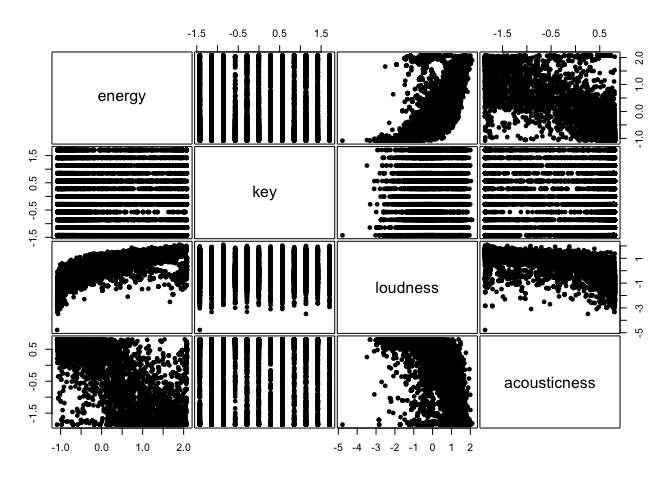<!-- -->

\#\#\#DBSCAN

``` r
set.seed(500)

model1 = dbscan(muestra1_sca, eps= 1, minPts = 3 )
model1
```

    ## DBSCAN clustering for 7000 objects.
    ## Parameters: eps = 1, minPts = 3
    ## The clustering contains 2 cluster(s) and 2 noise points.
    ## 
    ##    0    1    2 
    ##    2 6992    6 
    ## 
    ## Available fields: cluster, eps, minPts

``` r
set.seed(500)

c_means1 <- cmeans(muestra1_sca,  2,m=2) 

c_means1$membership %>% head()
```

    ##               1         2
    ## [1,] 0.03515649 0.9648435
    ## [2,] 0.34462073 0.6553793
    ## [3,] 0.77266741 0.2273326
    ## [4,] 0.16232220 0.8376778
    ## [5,] 0.11287959 0.8871204
    ## [6,] 0.03323325 0.9667667

``` r
matrix1 <- c_means1$membership%*%t(c_means1$membership) 

(FPC <- sum(matrix1*diag(nrow(matrix1)))/nrow(matrix1))
```

    ## [1] 0.7455881

\#\#\#GMM

``` r
set.seed(500)

model_gmm1 = Mclust(muestra1_sca)

model_gmm1
```

    ## 'Mclust' model object: (VVV,9) 
    ## 
    ## Available components: 
    ##  [1] "call"           "data"           "modelName"      "n"             
    ##  [5] "d"              "G"              "BIC"            "loglik"        
    ##  [9] "df"             "bic"            "icl"            "hypvol"        
    ## [13] "parameters"     "z"              "classification" "uncertainty"

``` r
summary(model_gmm1, parameters = TRUE)
```

    ## ---------------------------------------------------- 
    ## Gaussian finite mixture model fitted by EM algorithm 
    ## ---------------------------------------------------- 
    ## 
    ## Mclust VVV (ellipsoidal, varying volume, shape, and orientation) model with 9
    ## components: 
    ## 
    ##  log-likelihood    n  df       BIC      ICL
    ##       -18886.55 7000 134 -38959.49 -41097.4
    ## 
    ## Clustering table:
    ##    1    2    3    4    5    6    7    8    9 
    ##  775 1003  680  821  797  485  449  942 1048 
    ## 
    ## Mixing probabilities:
    ##          1          2          3          4          5          6          7 
    ## 0.10090114 0.15037811 0.09505758 0.12651820 0.10599449 0.06614773 0.06804110 
    ##          8          9 
    ## 0.13911459 0.14784706 
    ## 
    ## Means:
    ##                     [,1]        [,2]       [,3]         [,4]       [,5]
    ## energy       -0.97481173 -0.63280308 -0.6129806  1.006972621 -0.6296123
    ## key           0.02668963 -0.04817071  0.9281237  0.001371668 -0.8579421
    ## loudness     -1.09342116 -0.15768396 -0.3777350 -0.251573232 -0.3461853
    ## acousticness  0.80462764  0.68117556  0.7860688 -0.765261094  0.7870542
    ##                    [,6]       [,7]        [,8]        [,9]
    ## energy        1.5798395 -0.9936161 -0.08269910  1.12096546
    ## key           0.1145351 -0.1519874 -0.01808411  0.08366834
    ## loudness      1.4127218 -1.3442327  0.31833245  1.29998259
    ## acousticness -1.8526895  0.6535137  0.26432777 -1.37732816
    ## 
    ## Variances:
    ## [,,1]
    ##                     energy          key      loudness  acousticness
    ## energy        6.782035e-03 0.0062392389  0.0308794091 -9.473471e-05
    ## key           6.239239e-03 0.9186721441  0.0371513724  1.098042e-04
    ## loudness      3.087941e-02 0.0371513724  0.3476237061 -9.153207e-04
    ## acousticness -9.473471e-05 0.0001098042 -0.0009153207  1.947503e-05
    ## [,,2]
    ##                    energy          key    loudness acousticness
    ## energy        0.056782916 -0.019511990  0.07540721 -0.004224445
    ## key          -0.019511990  0.862024853 -0.03830763 -0.001787914
    ## loudness      0.075407214 -0.038307633  0.23236414 -0.011392421
    ## acousticness -0.004224445 -0.001787914 -0.01139242  0.005256635
    ## [,,3]
    ##                     energy           key     loudness  acousticness
    ## energy        0.0794211593 -0.0190606855  0.070001602  0.0002015473
    ## key          -0.0190606855  0.2300365752 -0.009626017 -0.0006803948
    ## loudness      0.0700016017 -0.0096260165  0.232209791 -0.0010526001
    ## acousticness  0.0002015473 -0.0006803948 -0.001052600  0.0003321172
    ## [,,4]
    ##                  energy         key    loudness acousticness
    ## energy       0.83226065  0.02474051  0.15804834   0.27447070
    ## key          0.02474051  1.13625857 -0.01295308   0.06593682
    ## loudness     0.15804834 -0.01295308  0.64023078   0.11491159
    ## acousticness 0.27447070  0.06593682  0.11491159   0.59985886
    ## [,,5]
    ##                     energy           key     loudness  acousticness
    ## energy        0.0714758928 -0.0016037311  0.077372728 -0.0001374806
    ## key          -0.0016037311  0.2090273058  0.014662385  0.0001391714
    ## loudness      0.0773727278  0.0146623853  0.266839456 -0.0020084758
    ## acousticness -0.0001374806  0.0001391714 -0.002008476  0.0002605034
    ## [,,6]
    ##                    energy           key      loudness  acousticness
    ## energy        0.163284683  0.0195854256  0.0678383342 -6.575620e-04
    ## key           0.019585426  1.0478973960  0.0068992805 -7.073746e-04
    ## loudness      0.067838334  0.0068992805  0.0911185965 -1.022985e-04
    ## acousticness -0.000657562 -0.0007073746 -0.0001022985  6.622851e-05
    ## [,,7]
    ##                    energy         key     loudness acousticness
    ## energy        0.004122444 0.001110107  0.037960987 -0.001730763
    ## key           0.001110107 0.946734819  0.044322042  0.004553702
    ## loudness      0.037960987 0.044322042  0.585125288 -0.007270466
    ## acousticness -0.001730763 0.004553702 -0.007270466  0.017338812
    ## [,,8]
    ##                    energy          key    loudness acousticness
    ## energy        0.227951583  0.002376949  0.20238597  -0.01885061
    ## key           0.002376949  0.976842575  0.01762412  -0.02662846
    ## loudness      0.202385970  0.017624124  0.42835282  -0.04794539
    ## acousticness -0.018850607 -0.026628456 -0.04794539   0.11482456
    ## [,,9]
    ##                    energy           key      loudness acousticness
    ## energy        0.313113435 -0.0036298635  0.1206720849  -0.09026929
    ## key          -0.003629864  1.0570575809  0.0006552959   0.01060623
    ## loudness      0.120672085  0.0006552959  0.1047603914  -0.03508938
    ## acousticness -0.090269287  0.0106062285 -0.0350893833   0.17630930

\#\#Plot

``` r
ggplot(muestra1_sca) + 
  aes(x=energy, y=loudness, color=factor(model_gmm1$classification)) + 
  geom_point(alpha=1)
```

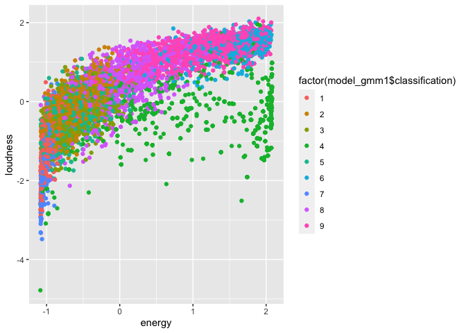<!-- -->

``` r
fviz_cluster(model_gmm1, muestra1_sca, stand = FALSE, frame = FALSE,geom = "point")
```

    ## Warning: argument frame is deprecated; please use ellipse instead.

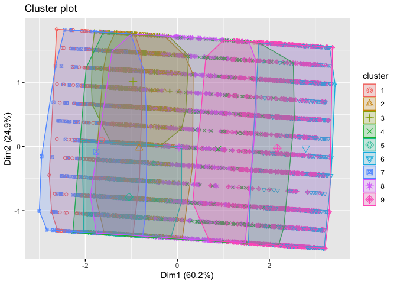<!-- -->

``` r
plot(model_gmm1, what = "BIC")
```

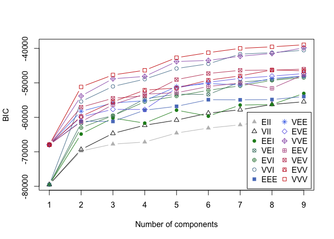<!-- -->

TERCER ANÁLISIS

``` r
spotify_muestra2 <- spotify_muestra[colnames(spotify_muestra) %in% c("speechiness", "loudness", "instrumentalnes", "liveness")]

class2 <- spotify_muestra2$loudness

muestra2_sca <- sapply(spotify_muestra2, scale) %>% as_tibble()

clPairs(muestra2_sca,class1)
```

    ## Warning in clPairs(muestra2_sca, class1): more colors needed

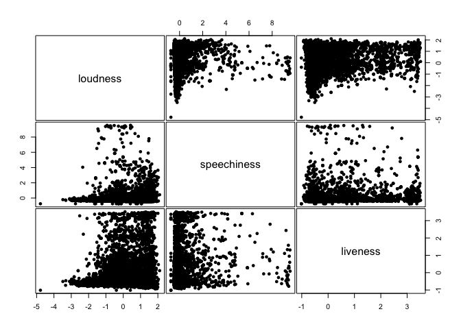<!-- -->

\#\#\#DBSCAN

``` r
set.seed(500)

model2 <- dbscan(muestra2_sca, eps = 1, minPts = 3)

model2
```

    ## DBSCAN clustering for 7000 objects.
    ## Parameters: eps = 1, minPts = 3
    ## The clustering contains 4 cluster(s) and 9 noise points.
    ## 
    ##    0    1    2    3    4 
    ##    9 6947    3   35    6 
    ## 
    ## Available fields: cluster, eps, minPts

\#\#\#FUZZY C-MEANS

``` r
set.seed(500)

c_means2 <- cmeans(muestra2_sca, 4, m = 1.5 )

c_means2$membership %>% head()
```

    ##                 1            2           3            4
    ## [1,] 0.0907650714 2.473594e-02 0.787627422 0.0968715695
    ## [2,] 0.0129534160 7.494806e-03 0.204670010 0.7748817672
    ## [3,] 0.1280822782 6.507643e-02 0.678443424 0.1283978681
    ## [4,] 0.5253931589 6.321479e-04 0.469528772 0.0044459209
    ## [5,] 0.9932885548 1.858558e-04 0.006078574 0.0004470151
    ## [6,] 0.0005539301 1.463689e-05 0.998904670 0.0005267627

``` r
matrix <- c_means2$membership %*% t(c_means2$membership)
(FPC <- sum(matrix*diag(nrow(matrix)))/nrow(matrix))
```

    ## [1] 0.8064378

\#\#\#GMM

``` r
set.seed(500)

model_gmm2 = Mclust(muestra2_sca)

model_gmm2
```

    ## 'Mclust' model object: (VVV,9) 
    ## 
    ## Available components: 
    ##  [1] "call"           "data"           "modelName"      "n"             
    ##  [5] "d"              "G"              "BIC"            "loglik"        
    ##  [9] "df"             "bic"            "icl"            "hypvol"        
    ## [13] "parameters"     "z"              "classification" "uncertainty"

``` r
summary(model_gmm2, parameters = TRUE)
```

    ## ---------------------------------------------------- 
    ## Gaussian finite mixture model fitted by EM algorithm 
    ## ---------------------------------------------------- 
    ## 
    ## Mclust VVV (ellipsoidal, varying volume, shape, and orientation) model with 9
    ## components: 
    ## 
    ##  log-likelihood    n df       BIC       ICL
    ##       -12455.15 7000 89 -25698.28 -29573.57
    ## 
    ## Clustering table:
    ##    1    2    3    4    5    6    7    8    9 
    ## 2130  614  735 1236  399  512  430  676  268 
    ## 
    ## Mixing probabilities:
    ##          1          2          3          4          5          6          7 
    ## 0.27242469 0.08443242 0.10717343 0.17881148 0.06288567 0.06940561 0.07539257 
    ##          8          9 
    ## 0.10642151 0.04305262 
    ## 
    ## Means:
    ##                   [,1]        [,2]       [,3]       [,4]      [,5]       [,6]
    ## loudness    -0.5762379  0.36084833 -0.3285009  0.1294652 0.5993607  1.4570273
    ## speechiness -0.2837170 -0.06675176 -0.2381300 -0.3652876 1.0194698 -0.1718286
    ## liveness    -0.5681762  2.41882154 -0.3271117 -0.5196616 0.2530283 -0.1256463
    ##                    [,7]        [,8]      [,9]
    ## loudness    -0.20232782  0.06170493 0.1960635
    ## speechiness  0.08634123 -0.27883833 3.3620965
    ## liveness    -0.55392624  0.38661506 1.6715328
    ## 
    ## Variances:
    ## [,,1]
    ##                 loudness   speechiness      liveness
    ## loudness     0.871159457 -0.0080550262  0.0052132795
    ## speechiness -0.008055026  0.0041225352 -0.0002748938
    ## liveness     0.005213280 -0.0002748938  0.0082419007
    ## [,,2]
    ##               loudness speechiness   liveness
    ## loudness    0.85574638  0.01165150 0.08459859
    ## speechiness 0.01165150  0.08477556 0.01394744
    ## liveness    0.08459859  0.01394744 0.57473248
    ## [,,3]
    ##                 loudness  speechiness    liveness
    ## loudness     0.273705608 -0.003690111 -0.00601327
    ## speechiness -0.003690111  0.008829870 -0.01303616
    ## liveness    -0.006013270 -0.013036164  0.04595508
    ## [,,4]
    ##                loudness   speechiness      liveness
    ## loudness     0.67937560 -0.0263052440 -0.0184884670
    ## speechiness -0.02630524  0.0026859590  0.0003109719
    ## liveness    -0.01848847  0.0003109719  0.0177259942
    ## [,,5]
    ##               loudness speechiness   liveness
    ## loudness     0.8263562   0.2593998 -0.1309986
    ## speechiness  0.2593998   0.8647535 -0.2097144
    ## liveness    -0.1309986  -0.2097144  0.4299659
    ## [,,6]
    ##                loudness  speechiness    liveness
    ## loudness    0.044045831  0.006759692  0.01350522
    ## speechiness 0.006759692  0.040400053 -0.00250881
    ## liveness    0.013505217 -0.002508810  0.24574733
    ## [,,7]
    ##                loudness  speechiness     liveness
    ## loudness     1.14390033  0.090789044 -0.011839644
    ## speechiness  0.09078904  0.075145650 -0.000561187
    ## liveness    -0.01183964 -0.000561187  0.014773457
    ## [,,8]
    ##                loudness  speechiness     liveness
    ## loudness     0.67177444 -0.035877240 -0.078405708
    ## speechiness -0.03587724  0.011613430  0.004354327
    ## liveness    -0.07840571  0.004354327  0.166370944
    ## [,,9]
    ##               loudness speechiness   liveness
    ## loudness     0.8272120  -0.6197303  0.2642642
    ## speechiness -0.6197303   7.2219529 -2.0805720
    ## liveness     0.2642642  -2.0805720  1.6708789

``` r
plot(model_gmm2, what = "BIC")
```

<!-- -->
