Ayudantia 9
================

## Cargar Librerias

``` r
library(tidyverse)
```

    ## ── Attaching packages ─────────────────────────────────────── tidyverse 1.3.0 ──

    ## ✓ ggplot2 3.3.3     ✓ purrr   0.3.4
    ## ✓ tibble  3.1.0     ✓ dplyr   1.0.5
    ## ✓ tidyr   1.1.3     ✓ stringr 1.4.0
    ## ✓ readr   1.4.0     ✓ forcats 0.5.1

    ## ── Conflicts ────────────────────────────────────────── tidyverse_conflicts() ──
    ## x dplyr::filter() masks stats::filter()
    ## x dplyr::lag()    masks stats::lag()

``` r
library('GGally')
```

    ## Registered S3 method overwritten by 'GGally':
    ##   method from   
    ##   +.gg   ggplot2

``` r
library(regclass)
```

    ## Loading required package: bestglm

    ## Loading required package: leaps

    ## Loading required package: VGAM

    ## Loading required package: stats4

    ## Loading required package: splines

    ## 
    ## Attaching package: 'VGAM'

    ## The following object is masked from 'package:tidyr':
    ## 
    ##     fill

    ## Loading required package: rpart

    ## Loading required package: randomForest

    ## randomForest 4.6-14

    ## Type rfNews() to see new features/changes/bug fixes.

    ## 
    ## Attaching package: 'randomForest'

    ## The following object is masked from 'package:dplyr':
    ## 
    ##     combine

    ## The following object is masked from 'package:ggplot2':
    ## 
    ##     margin

    ## Important regclass change from 1.3:
    ## All functions that had a . in the name now have an _
    ## all.correlations -> all_correlations, cor.demo -> cor_demo, etc.

``` r
library(pROC)
```

    ## Type 'citation("pROC")' for a citation.

    ## 
    ## Attaching package: 'pROC'

    ## The following objects are masked from 'package:stats':
    ## 
    ##     cov, smooth, var

``` r
library(rsample)
```

## Cargar Datos

``` r
setwd('/Users/amara/Documents/GitHub/Actividades-Ayudantias/Ayudantia 9')
toyota <- read.csv("toyota.csv")
```

## Regresion Lineal Toyota

Este dataset contiene informacion sobre el modelo del auto, año, precio,
transmision, kilometraje, mpg (millas por galon), tipo de combustible,
impuesto de circulacion, y tamaño del motor. (La data ya esta limpiada
en cuanto a datos duplicados y columnas relevantes).

En este analisis lo que buscaremos es predecir el precio al que
podriamos vender mi auto.

Para esto transformamos las variables del modelo, transmision y tipo de
combustible, a factores para trabajar con dichos valores como
“etiquetas”

``` r
summary(toyota)
```

    ##     model                year          price       transmission      
    ##  Length:6738        Min.   :1998   Min.   :  850   Length:6738       
    ##  Class :character   1st Qu.:2016   1st Qu.: 8290   Class :character  
    ##  Mode  :character   Median :2017   Median :10795   Mode  :character  
    ##                     Mean   :2017   Mean   :12522                     
    ##                     3rd Qu.:2018   3rd Qu.:14995                     
    ##                     Max.   :2020   Max.   :59995                     
    ##     mileage         fuelType              tax             mpg        
    ##  Min.   :     2   Length:6738        Min.   :  0.0   Min.   :  2.80  
    ##  1st Qu.:  9446   Class :character   1st Qu.:  0.0   1st Qu.: 55.40  
    ##  Median : 18513   Mode  :character   Median :135.0   Median : 62.80  
    ##  Mean   : 22857                      Mean   : 94.7   Mean   : 63.04  
    ##  3rd Qu.: 31064                      3rd Qu.:145.0   3rd Qu.: 69.00  
    ##  Max.   :174419                      Max.   :565.0   Max.   :235.00  
    ##    engineSize   
    ##  Min.   :0.000  
    ##  1st Qu.:1.000  
    ##  Median :1.500  
    ##  Mean   :1.471  
    ##  3rd Qu.:1.800  
    ##  Max.   :4.500

``` r
toyota %>% head()
```

    ##   model year price transmission mileage fuelType tax  mpg engineSize
    ## 1  GT86 2016 16000       Manual   24089   Petrol 265 36.2          2
    ## 2  GT86 2017 15995       Manual   18615   Petrol 145 36.2          2
    ## 3  GT86 2015 13998       Manual   27469   Petrol 265 36.2          2
    ## 4  GT86 2017 18998       Manual   14736   Petrol 150 36.2          2
    ## 5  GT86 2017 17498       Manual   36284   Petrol 145 36.2          2
    ## 6  GT86 2017 15998       Manual   26919   Petrol 260 36.2          2

``` r
toyota$model <- as.factor(toyota$model)
toyota$transmission <- as.factor(toyota$transmission)
toyota$fuelType <- as.factor(toyota$fuelType)

summary(toyota)
```

    ##       model           year          price          transmission 
    ##   Yaris  :2122   Min.   :1998   Min.   :  850   Automatic:2657  
    ##   Aygo   :1961   1st Qu.:2016   1st Qu.: 8290   Manual   :3826  
    ##   Auris  : 712   Median :2017   Median :10795   Other    :   1  
    ##   C-HR   : 479   Mean   :2017   Mean   :12522   Semi-Auto: 254  
    ##   RAV4   : 473   3rd Qu.:2018   3rd Qu.:14995                   
    ##   Corolla: 267   Max.   :2020   Max.   :59995                   
    ##  (Other) : 724                                                  
    ##     mileage         fuelType         tax             mpg        
    ##  Min.   :     2   Diesel: 503   Min.   :  0.0   Min.   :  2.80  
    ##  1st Qu.:  9446   Hybrid:2043   1st Qu.:  0.0   1st Qu.: 55.40  
    ##  Median : 18513   Other : 105   Median :135.0   Median : 62.80  
    ##  Mean   : 22857   Petrol:4087   Mean   : 94.7   Mean   : 63.04  
    ##  3rd Qu.: 31064                 3rd Qu.:145.0   3rd Qu.: 69.00  
    ##  Max.   :174419                 Max.   :565.0   Max.   :235.00  
    ##                                                                 
    ##    engineSize   
    ##  Min.   :0.000  
    ##  1st Qu.:1.000  
    ##  Median :1.500  
    ##  Mean   :1.471  
    ##  3rd Qu.:1.800  
    ##  Max.   :4.500  
    ## 

``` r
toyota %>% filter(engineSize == 0) %>% nrow()
```

    ## [1] 6

``` r
toyota <- toyota %>%  filter(engineSize != 0)

summary(toyota)
```

    ##       model           year          price          transmission 
    ##   Yaris  :2120   Min.   :1998   Min.   :  850   Automatic:2656  
    ##   Aygo   :1958   1st Qu.:2016   1st Qu.: 8290   Manual   :3821  
    ##   Auris  : 712   Median :2017   Median :10795   Other    :   1  
    ##   C-HR   : 478   Mean   :2017   Mean   :12524   Semi-Auto: 254  
    ##   RAV4   : 473   3rd Qu.:2018   3rd Qu.:14995                   
    ##   Corolla: 267   Max.   :2020   Max.   :59995                   
    ##  (Other) : 724                                                  
    ##     mileage         fuelType         tax              mpg        
    ##  Min.   :     2   Diesel: 503   Min.   :  0.00   Min.   :  2.80  
    ##  1st Qu.:  9448   Hybrid:2041   1st Qu.:  0.00   1st Qu.: 55.40  
    ##  Median : 18516   Other : 105   Median :135.00   Median : 62.80  
    ##  Mean   : 22861   Petrol:4083   Mean   : 94.69   Mean   : 63.04  
    ##  3rd Qu.: 31061                 3rd Qu.:145.00   3rd Qu.: 69.00  
    ##  Max.   :174419                 Max.   :565.00   Max.   :235.00  
    ##                                                                  
    ##    engineSize   
    ##  Min.   :1.000  
    ##  1st Qu.:1.000  
    ##  Median :1.500  
    ##  Mean   :1.473  
    ##  3rd Qu.:1.800  
    ##  Max.   :4.500  
    ## 

``` r
sum(is.na(toyota))
```

    ## [1] 0

``` r
sum(is.null(toyota))
```

    ## [1] 0

``` r
toyota %>% select(year, mileage, tax, mpg, engineSize, price) %>% 
  ggpairs(lower = list(continuous = wrap("points", alpha = 0.3, size = 0.5)))
```

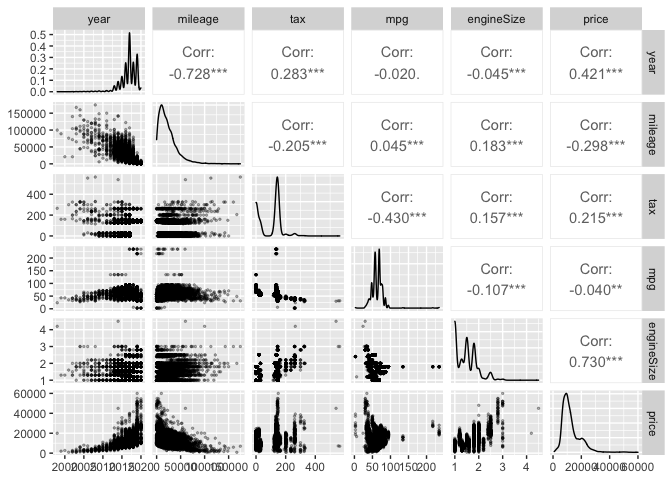<!-- -->

``` r
toyota %>% 
  ggplot(aes(transmission, price)) +
  geom_boxplot()
```

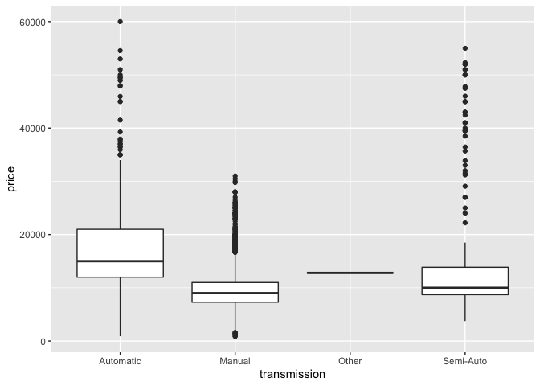<!-- -->

``` r
toyota %>% 
  ggplot(aes(fuelType, price)) +
  geom_boxplot()
```

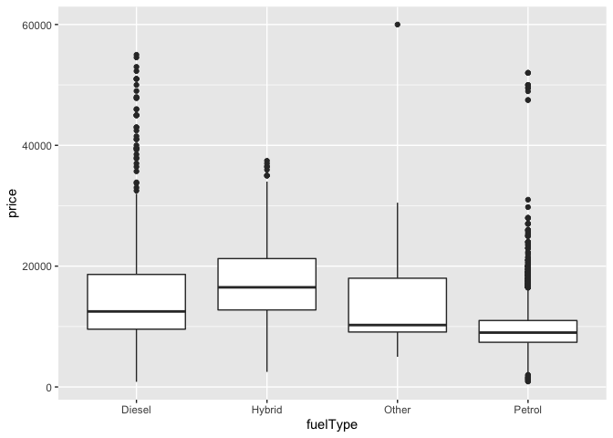<!-- -->

``` r
toyota %>% mutate(model = reorder(model, price)) %>%
  ggplot(aes(price, model)) +
  geom_boxplot()
```

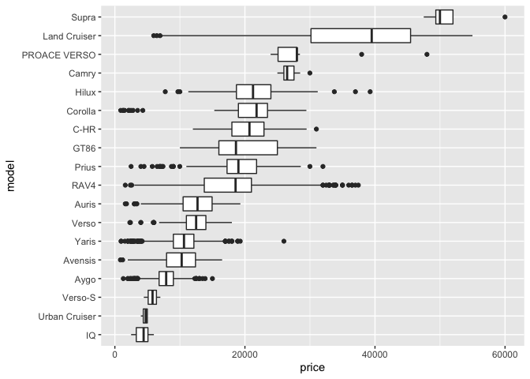<!-- -->

``` r
toyota %>% ggplot(aes(mileage, price)) +
  geom_point(alpha = .1) +
  stat_smooth(method = "gam", formula = y ~ s(x, k=3))
```

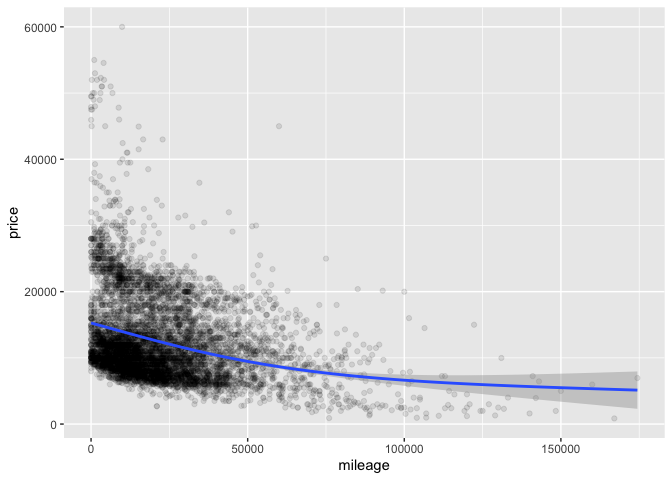<!-- -->

``` r
toyota %>% ggplot(aes(year, price)) +
  geom_point(alpha = .1) +
  stat_smooth(method = "gam", formula = y ~ s(x, k=3))
```

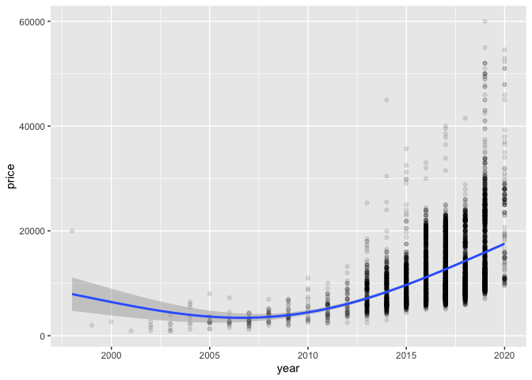<!-- -->

``` r
toyota %>% ggplot(aes(mpg, price)) +
  geom_point(alpha = .1) +
  stat_smooth(method = "gam", formula = y ~ s(x, k=3))
```

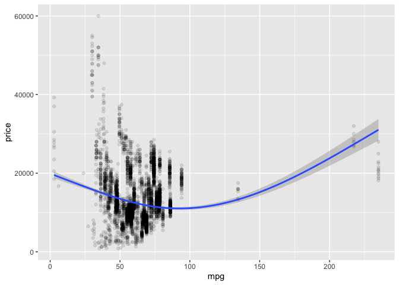<!-- -->

``` r
toyota %>% ggplot(aes(engineSize, price)) +
  geom_point(alpha = .1) +
  stat_smooth(method = "gam", formula = y ~ s(x, k=3))
```

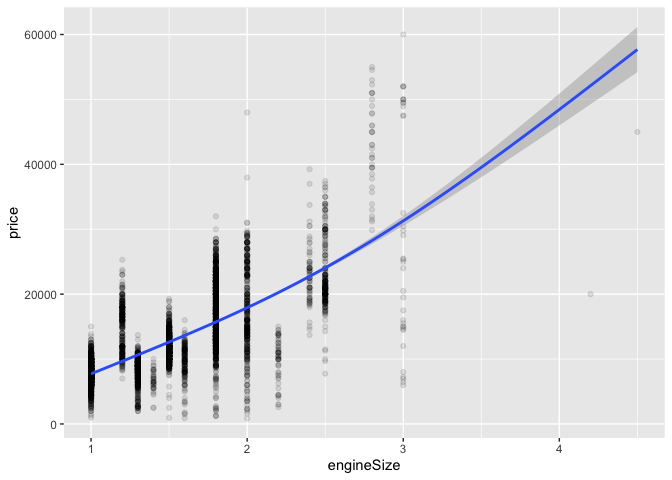<!-- -->

``` r
toyota %>% filter(., year >= 2005) %>% ggplot(aes(year, price)) +
  geom_point(alpha = .1) +
  stat_smooth(method = "gam", formula = y ~ s(x, k=3))
```

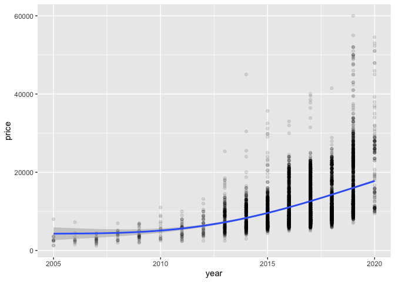<!-- -->

# Escalamos Datos

``` r
toyota_sca <- toyota
toyota_sca[,c(2,3,5,7,8,9)] <- scale(toyota_sca[,c(2,3,5,7,8,9)])

toyota_sca %>%  head()
```

    ##   model       year     price transmission     mileage fuelType       tax
    ## 1  GT86 -0.3390016 0.5476207       Manual  0.06418306   Petrol 2.3050056
    ## 2  GT86  0.1146177 0.5468329       Manual -0.22202169   Petrol 0.6808592
    ## 3  GT86 -0.7926209 0.2322067       Manual  0.24090429   Petrol 2.3050056
    ## 4  GT86  0.1146177 1.0199538       Manual -0.42483283   Petrol 0.7485320
    ## 5  GT86  0.1146177 0.7836297       Manual  0.70179118   Petrol 0.6808592
    ## 6  GT86  0.1146177 0.5473056       Manual  0.21214788   Petrol 2.2373329
    ##         mpg engineSize
    ## 1 -1.694806   1.214812
    ## 2 -1.694806   1.214812
    ## 3 -1.694806   1.214812
    ## 4 -1.694806   1.214812
    ## 5 -1.694806   1.214812
    ## 6 -1.694806   1.214812

# Regresión Simple

Los resultados de la regresion nos indican que los valores de los
parametros son 0.0001479 para el intercepto y -0.09901 para el
coeficiente asociado a la variable superficie de terreno.

Tambien se puede observar que el coeficiente de determinacion R2 es de
0.08901, lo que significa que el 8.9% de la varianza del precio esta
explicada por el modelo lineal.

``` r
reg_simp <- lm(price ~ mileage, data = toyota)
summary(reg_simp)
```

    ## 
    ## Call:
    ## lm(formula = price ~ mileage, data = toyota)
    ## 
    ## Residuals:
    ##    Min     1Q Median     3Q    Max 
    ## -10013  -4437  -1910   2991  46188 
    ## 
    ## Coefficients:
    ##               Estimate Std. Error t value Pr(>|t|)    
    ## (Intercept)  1.479e+04  1.151e+02  128.50   <2e-16 ***
    ## mileage     -9.901e-02  3.861e-03  -25.64   <2e-16 ***
    ## ---
    ## Signif. codes:  0 '***' 0.001 '**' 0.01 '*' 0.05 '.' 0.1 ' ' 1
    ## 
    ## Residual standard error: 6059 on 6730 degrees of freedom
    ## Multiple R-squared:  0.08901,    Adjusted R-squared:  0.08888 
    ## F-statistic: 657.6 on 1 and 6730 DF,  p-value: < 2.2e-16

Veamos que pasa ahora al considerar mas variables en nuestro modelo de
regresion, para eso consideraremos el modelo, el año, su kilometraje, el
tamaño del motor y las millas por galon.

# Regresión simple 2

Los resultados de la regresion multiple nos muestra un coeficiente de
determinacion del 90.78%, y se puede ver que todas las variables son
significativas a excepcion de algunos modelos de autos que no tienen
significancia para nuestro modelo.

Revisamos el valor del facto de inflacion de la varianza, este factor
nos permite entender la colinealidad de los datos.

Un VIF por encima de 4 o una tolerancia por debajo de 0,25 indica que
podría existir multicolinealidad y se requiere más investigación.

``` r
reg_mult <- lm(price ~ model + year*mileage + engineSize + mpg, data = toyota_sca)
summary(reg_mult)
```

    ## 
    ## Call:
    ## lm(formula = price ~ model + year * mileage + engineSize + mpg, 
    ##     data = toyota_sca)
    ## 
    ## Residuals:
    ##      Min       1Q   Median       3Q      Max 
    ## -2.87872 -0.16417 -0.02289  0.14310  2.91021 
    ## 
    ## Coefficients:
    ##                      Estimate Std. Error t value Pr(>|t|)    
    ## (Intercept)         -0.001391   0.012592  -0.110  0.91207    
    ## model Avensis       -0.282469   0.031308  -9.022  < 2e-16 ***
    ## model Aygo          -0.327626   0.021985 -14.902  < 2e-16 ***
    ## model C-HR           0.890092   0.018572  47.927  < 2e-16 ***
    ## model Camry          0.727859   0.095175   7.648 2.34e-14 ***
    ## model Corolla        0.713442   0.023484  30.380  < 2e-16 ***
    ## model GT86           0.573701   0.040290  14.239  < 2e-16 ***
    ## model Hilux          0.426034   0.043258   9.849  < 2e-16 ***
    ## model IQ             0.110512   0.109436   1.010  0.31262    
    ## model Land Cruiser   2.503718   0.056755  44.115  < 2e-16 ***
    ## model Prius          0.703969   0.024537  28.691  < 2e-16 ***
    ## model PROACE VERSO   1.554445   0.080749  19.250  < 2e-16 ***
    ## model RAV4           0.308238   0.024964  12.347  < 2e-16 ***
    ## model Supra          3.976318   0.096118  41.369  < 2e-16 ***
    ## model Urban Cruiser -0.164767   0.152913  -1.078  0.28129    
    ## model Verso         -0.081461   0.031494  -2.587  0.00972 ** 
    ## model Verso-S        0.049601   0.176269   0.281  0.77842    
    ## model Yaris         -0.271531   0.014861 -18.271  < 2e-16 ***
    ## year                 0.253938   0.006011  42.249  < 2e-16 ***
    ## mileage             -0.226710   0.005921 -38.288  < 2e-16 ***
    ## engineSize           0.463494   0.010908  42.493  < 2e-16 ***
    ## mpg                  0.057956   0.005039  11.501  < 2e-16 ***
    ## year:mileage        -0.011753   0.002145  -5.478 4.46e-08 ***
    ## ---
    ## Signif. codes:  0 '***' 0.001 '**' 0.01 '*' 0.05 '.' 0.1 ' ' 1
    ## 
    ## Residual standard error: 0.3041 on 6709 degrees of freedom
    ## Multiple R-squared:  0.9078, Adjusted R-squared:  0.9075 
    ## F-statistic:  3004 on 22 and 6709 DF,  p-value: < 2.2e-16

``` r
VIF(reg_mult)
```

    ##                   GVIF Df GVIF^(1/(2*Df))
    ## model        17.256587 17        1.087379
    ## year          2.629541  1        1.621586
    ## mileage       2.551935  1        1.597478
    ## engineSize    8.659920  1        2.942774
    ## mpg           1.848271  1        1.359511
    ## year:mileage  1.961630  1        1.400582

``` r
library(olsrr)
```

    ## 
    ## Attaching package: 'olsrr'

    ## The following object is masked from 'package:datasets':
    ## 
    ##     rivers

``` r
fuerza_bruta <- ols_step_all_possible(reg_mult)

plot(fuerza_bruta)
```

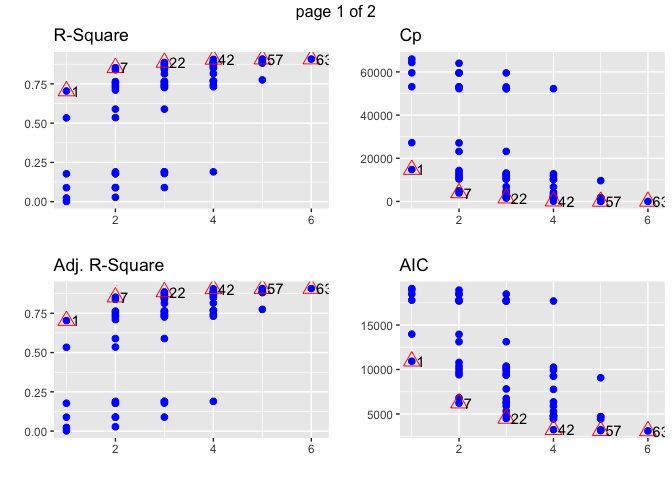<!-- -->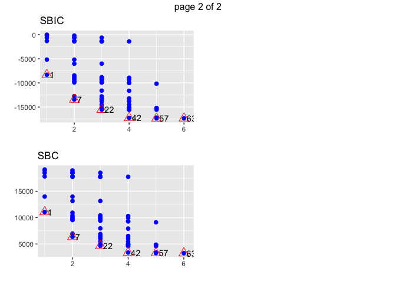<!-- -->

## Regresión Logística

``` r
wine <- read.csv("winequality-red.csv")
summary(wine)
```

    ##  fixed.acidity   volatile.acidity  citric.acid    residual.sugar  
    ##  Min.   : 4.60   Min.   :0.1200   Min.   :0.000   Min.   : 0.900  
    ##  1st Qu.: 7.10   1st Qu.:0.3900   1st Qu.:0.090   1st Qu.: 1.900  
    ##  Median : 7.90   Median :0.5200   Median :0.260   Median : 2.200  
    ##  Mean   : 8.32   Mean   :0.5278   Mean   :0.271   Mean   : 2.539  
    ##  3rd Qu.: 9.20   3rd Qu.:0.6400   3rd Qu.:0.420   3rd Qu.: 2.600  
    ##  Max.   :15.90   Max.   :1.5800   Max.   :1.000   Max.   :15.500  
    ##    chlorides       free.sulfur.dioxide total.sulfur.dioxide    density      
    ##  Min.   :0.01200   Min.   : 1.00       Min.   :  6.00       Min.   :0.9901  
    ##  1st Qu.:0.07000   1st Qu.: 7.00       1st Qu.: 22.00       1st Qu.:0.9956  
    ##  Median :0.07900   Median :14.00       Median : 38.00       Median :0.9968  
    ##  Mean   :0.08747   Mean   :15.87       Mean   : 46.47       Mean   :0.9967  
    ##  3rd Qu.:0.09000   3rd Qu.:21.00       3rd Qu.: 62.00       3rd Qu.:0.9978  
    ##  Max.   :0.61100   Max.   :72.00       Max.   :289.00       Max.   :1.0037  
    ##        pH          sulphates         alcohol         quality     
    ##  Min.   :2.740   Min.   :0.3300   Min.   : 8.40   Min.   :3.000  
    ##  1st Qu.:3.210   1st Qu.:0.5500   1st Qu.: 9.50   1st Qu.:5.000  
    ##  Median :3.310   Median :0.6200   Median :10.20   Median :6.000  
    ##  Mean   :3.311   Mean   :0.6581   Mean   :10.42   Mean   :5.636  
    ##  3rd Qu.:3.400   3rd Qu.:0.7300   3rd Qu.:11.10   3rd Qu.:6.000  
    ##  Max.   :4.010   Max.   :2.0000   Max.   :14.90   Max.   :8.000

``` r
wine %>% head()
```

    ##   fixed.acidity volatile.acidity citric.acid residual.sugar chlorides
    ## 1           7.4             0.70        0.00            1.9     0.076
    ## 2           7.8             0.88        0.00            2.6     0.098
    ## 3           7.8             0.76        0.04            2.3     0.092
    ## 4          11.2             0.28        0.56            1.9     0.075
    ## 5           7.4             0.70        0.00            1.9     0.076
    ## 6           7.4             0.66        0.00            1.8     0.075
    ##   free.sulfur.dioxide total.sulfur.dioxide density   pH sulphates alcohol
    ## 1                  11                   34  0.9978 3.51      0.56     9.4
    ## 2                  25                   67  0.9968 3.20      0.68     9.8
    ## 3                  15                   54  0.9970 3.26      0.65     9.8
    ## 4                  17                   60  0.9980 3.16      0.58     9.8
    ## 5                  11                   34  0.9978 3.51      0.56     9.4
    ## 6                  13                   40  0.9978 3.51      0.56     9.4
    ##   quality
    ## 1       5
    ## 2       5
    ## 3       5
    ## 4       6
    ## 5       5
    ## 6       5

``` r
glimpse(wine)
```

    ## Rows: 1,599
    ## Columns: 12
    ## $ fixed.acidity        <dbl> 7.4, 7.8, 7.8, 11.2, 7.4, 7.4, 7.9, 7.3, 7.8, 7.5…
    ## $ volatile.acidity     <dbl> 0.700, 0.880, 0.760, 0.280, 0.700, 0.660, 0.600, …
    ## $ citric.acid          <dbl> 0.00, 0.00, 0.04, 0.56, 0.00, 0.00, 0.06, 0.00, 0…
    ## $ residual.sugar       <dbl> 1.9, 2.6, 2.3, 1.9, 1.9, 1.8, 1.6, 1.2, 2.0, 6.1,…
    ## $ chlorides            <dbl> 0.076, 0.098, 0.092, 0.075, 0.076, 0.075, 0.069, …
    ## $ free.sulfur.dioxide  <dbl> 11, 25, 15, 17, 11, 13, 15, 15, 9, 17, 15, 17, 16…
    ## $ total.sulfur.dioxide <dbl> 34, 67, 54, 60, 34, 40, 59, 21, 18, 102, 65, 102,…
    ## $ density              <dbl> 0.9978, 0.9968, 0.9970, 0.9980, 0.9978, 0.9978, 0…
    ## $ pH                   <dbl> 3.51, 3.20, 3.26, 3.16, 3.51, 3.51, 3.30, 3.39, 3…
    ## $ sulphates            <dbl> 0.56, 0.68, 0.65, 0.58, 0.56, 0.56, 0.46, 0.47, 0…
    ## $ alcohol              <dbl> 9.4, 9.8, 9.8, 9.8, 9.4, 9.4, 9.4, 10.0, 9.5, 10.…
    ## $ quality              <int> 5, 5, 5, 6, 5, 5, 5, 7, 7, 5, 5, 5, 5, 5, 5, 5, 7…

``` r
ggplot(wine,aes(x=factor(quality))) +
  geom_bar(col ="black",fill="#993333",alpha=0.5) +
  theme(axis.text.x = element_text(face="bold", size=10)) +
  scale_x_discrete("quality") +
  scale_y_continuous("Count")
```

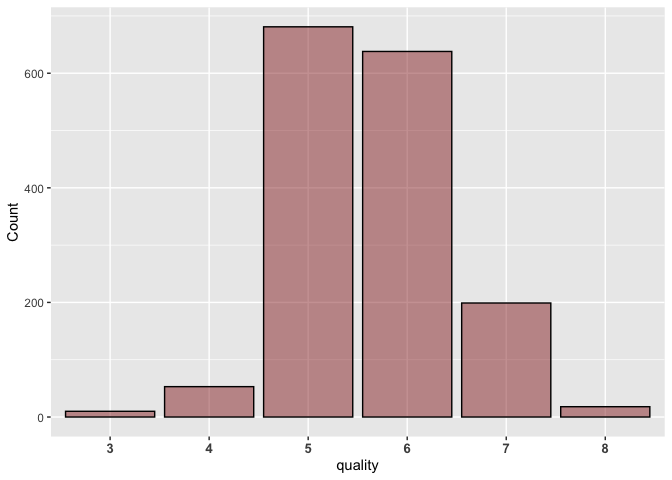<!-- -->

``` r
d <- wine %>% 
  group_by(quality) %>%
  count() %>%
  arrange(match(quality,names(quality)))
d <- data.frame(quality = d$quality,N =d$n)
d
```

    ##   quality   N
    ## 1       3  10
    ## 2       4  53
    ## 3       5 681
    ## 4       6 638
    ## 5       7 199
    ## 6       8  18
